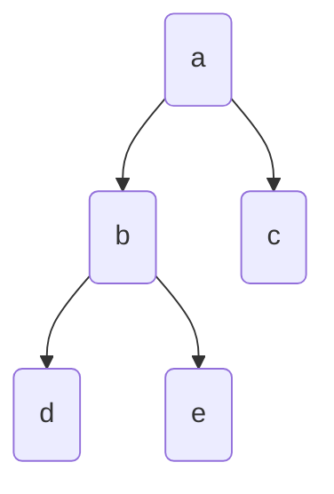

# 📋 Tree Demonstration

Here are some codes to get started.

## Construct Tree

Nodes can have attributes if they are initialized from `Node`, *dictionary*, *pandas DataFrame*, or *polars DataFrame*.

### 1. From Node

Nodes can be linked to each other in the following ways:

- Using `parent` and `children` setter methods
- Directly passing `parent` or `children` argument
- Using bitshift operator with the convention `parent >> child` or `child << parent`
- Using `.append(child)` or `.extend([child1, child2])` methods

=== "`parent` and `children` setter methods"
    ```python hl_lines="8-9"
    from bigtree import Node, tree_to_dot

    root = Node("a")
    b = Node("b")
    c = Node("c")
    d = Node("d")

    root.children = [b, c]
    d.parent = b

    root.show()
    # a
    # ├── b
    # │   └── d
    # └── c

    root.hshow()
    #      ┌─ b ─── d
    # ─ a ─┤
    #      └─ c

    root.vshow()
    #    ┌───┐
    #    │ a │
    #    └─┬─┘
    #   ┌──┴───┐
    # ┌─┴─┐  ┌─┴─┐
    # │ b │  │ c │
    # └─┬─┘  └───┘
    #   │
    # ┌─┴─┐
    # │ d │
    # └───┘

    graph = tree_to_dot(root, node_colour="gold")
    graph.write_png("assets/demo/tree.png")
    ```

=== "`parent` or `children` argument"
    ```python hl_lines="5-6"
    from bigtree import Node

    b = Node("b")
    c = Node("c")
    d = Node("d", parent=b)
    root = Node("a", children=[b, c])
    ```

=== "Bitshift operator"
    ```python hl_lines="8-10"
    from bigtree import Node

    root = Node("a")
    b = Node("b")
    c = Node("c")
    d = Node("d")

    root >> b
    root >> c
    d << b
    ```

=== "`append` and `extend`"
    ```python hl_lines="8-9"
    from bigtree import Node

    root = Node("a")
    b = Node("b")
    c = Node("c")
    d = Node("d")

    root.extend([b, c])
    b.append(d)
    ```


### 2. From str

Construct nodes only. Newick string notation supports parsing attributes.

=== "Tree string"
    ```python hl_lines="13"
    from bigtree import str_to_tree

    tree_str = """
    a
    ├── b
    │   ├── d
    │   └── e
    │       ├── g
    │       └── h
    └── c
        └── f
    """
    root = str_to_tree(tree_str)

    root.show()
    # a
    # ├── b
    # │   ├── d
    # │   └── e
    # │       ├── g
    # │       └── h
    # └── c
    #     └── f
    ```

=== "Newick string"
    ```python hl_lines="4"
    from bigtree import newick_to_tree

    newick_str = "((d,(g,h)e)b,(f)c)a"
    root = newick_to_tree(newick_str)

    root.show()
    # a
    # ├── b
    # │   ├── d
    # │   └── e
    # │       ├── g
    # │       └── h
    # └── c
    #     └── f
    ```

### 3. From list

Construct nodes only. List can contain either <mark>full paths</mark> or tuples of <mark>parent-child names</mark>.

=== "Full paths"
    ```python hl_lines="3"
    from bigtree import list_to_tree

    root = list_to_tree(["a/b/d", "a/c"])

    root.show()
    # a
    # ├── b
    # │   └── d
    # └── c
    ```

=== "Parent-child names"
    ```python hl_lines="3"
    from bigtree import list_to_tree_by_relation

    root = list_to_tree_by_relation([("a", "b"), ("a", "c"), ("b", "d")])

    root.show()
    # a
    # ├── b
    # │   └── d
    # └── c
    ```

### 4. From nested dictionary

Construct nodes with attributes. Dictionary can be in a <mark>flat structure</mark> where `key` is path and `value` is
dictionary of node attribute names and values, or in a <mark>recursive structure</mark> where `key` is node attribute
names and `value` is node attribute values, and list of children (recursive).

=== "Flat structure"
    ```python hl_lines="9"
    from bigtree import dict_to_tree

    path_dict = {
       "a": {"age": 90},
       "a/b": {"age": 65},
       "a/c": {"age": 60},
       "a/b/d": {"age": 40},
    }
    root = dict_to_tree(path_dict)

    root.show(attr_list=["age"])
    # a [age=90]
    # ├── b [age=65]
    # │   └── d [age=40]
    # └── c [age=60]
    ```

=== "Recursive structure"
    ```python hl_lines="17"
    from bigtree import nested_dict_to_tree

    path_dict = {
       "name": "a",
       "age": 90,
       "children": [
          {
             "name": "b",
             "age": 65,
             "children": [
                {"name": "d", "age": 40},
             ],
          },
          {"name": "c", "age": 60},
       ],
    }
    root = nested_dict_to_tree(path_dict)

    root.show(attr_list=["age"])
    # a [age=90]
    # ├── b [age=65]
    # │   └── d [age=40]
    # └── c [age=60]
    ```

### 5. From pandas/polars DataFrame

Construct nodes with attributes. *DataFrame* can contain either <mark>path column</mark> or
<mark>parent-child columns</mark>. Other columns can be used to specify attributes.

=== "pandas - Path column"
    ```python hl_lines="14"
    import pandas as pd

    from bigtree import dataframe_to_tree

    data = pd.DataFrame(
       [
          ["a", 90],
          ["a/b", 65],
          ["a/c", 60],
          ["a/b/d", 40],
       ],
       columns=["path", "age"],
    )
    root = dataframe_to_tree(data)

    root.show(attr_list=["age"])
    # a [age=90]
    # ├── b [age=65]
    # │   └── d [age=40]
    # └── c [age=60]
    ```

=== "pandas - Parent-child columns"
    ```python hl_lines="14"
    import pandas as pd

    from bigtree import dataframe_to_tree_by_relation

    data = pd.DataFrame(
       [
          ["a", None, 90],
          ["b", "a", 65],
          ["c", "a", 60],
          ["d", "b", 40],
       ],
       columns=["child", "parent", "age"],
    )
    root = dataframe_to_tree_by_relation(data)

    root.show(attr_list=["age"])
    # a [age=90]
    # ├── b [age=65]
    # │   └── d [age=40]
    # └── c [age=60]
    ```

=== "polars - Path column"
    ```python hl_lines="14"
    import polars as pl

    from bigtree import polars_to_tree

    data = pl.DataFrame(
       [
          ["a", 90],
          ["a/b", 65],
          ["a/c", 60],
          ["a/b/d", 40],
       ],
       schema=["path", "age"],
    )
    root = polars_to_tree(data)

    root.show(attr_list=["age"])
    # a [age=90]
    # ├── b [age=65]
    # │   └── d [age=40]
    # └── c [age=60]
    ```

=== "polars - Parent-child columns"
    ```python hl_lines="14"
    import polars as pl

    from bigtree import polars_to_tree_by_relation

    data = pl.DataFrame(
       [
          ["a", None, 90],
          ["b", "a", 65],
          ["c", "a", 60],
          ["d", "b", 40],
       ],
       schema=["child", "parent", "age"],
    )
    root = polars_to_tree_by_relation(data)

    root.show(attr_list=["age"])
    # a [age=90]
    # ├── b [age=65]
    # │   └── d [age=40]
    # └── c [age=60]
    ```

!!! note

    If tree is already created, nodes can still be added using path string, dictionary, and pandas/polars DataFrame!<br>
    Attributes can be added to existing nodes using a dictionary or pandas/polars DataFrame.

## View Tree

### 1. Print Tree

After tree is constructed, it can be viewed by printing to console using `show`, `hshow`, or `vshow` method directly,
for compact, horizontal, and vertical orientation respectively.
Alternatively, the `print_tree`, `hprint_tree`, or `vprint_tree` method can be used.

```python hl_lines="8 15"
from bigtree import Node, print_tree, hprint_tree, vprint_tree

root = Node("a", alias="alias-a", age=90, gender="F")
b = Node("b", age=65, gender="M", parent=root)
c = Node("c", alias="alias-c", age=60, gender="M", parent=root)
d = Node("d", age=40, gender="F", parent=b)
e = Node("e", age=35, gender="M", parent=b)
print_tree(root) # (1)!
# a
# ├── b
# │   ├── d
# │   └── e
# └── c

hprint_tree(root) # (2)!
#            ┌─ d
#      ┌─ b ─┤
# ─ a ─┤     └─ e
#      └─ c

vprint_tree(root) # (3)!
#         ┌───┐
#         │ a │
#         └─┬─┘
#      ┌────┴─────┐
#    ┌─┴─┐      ┌─┴─┐
#    │ b │      │ c │
#    └─┬─┘      └───┘
#   ┌──┴───┐
# ┌─┴─┐  ┌─┴─┐
# │ d │  │ e │
# └───┘  └───┘
```

1. Alternatively, `root.show()` can be used
2. Alternatively, `root.hshow()` can be used
3. Alternatively, `root.vshow()` can be used

Other customisations for printing are also available, such as:

- Printing alias instead of node name, if present
- Printing subtree
- Printing tree with attributes
- Different built-in or custom style and border style

=== "Alias"
    ```python hl_lines="1"
    root.show(alias="alias")
    # alias-a
    # ├── b
    # │   ├── d
    # │   └── e
    # └── alias-c
    ```
=== "Subtree"
    ```python hl_lines="1 6"
    root.show(node_name_or_path="b")
    # b
    # ├── d
    # └── e

    root.show(max_depth=2)
    # a
    # ├── b
    # └── c
    ```
=== "Tree with attributes"
    ```python hl_lines="1 8 15"
    root.show(attr_list=["age"])
    # a [age=90]
    # ├── b [age=65]
    # │   ├── d [age=40]
    # │   └── e [age=35]
    # └── c [age=60]

    root.show(attr_list=["age"], attr_bracket=["*(", ")"])
    # a *(age=90)
    # ├── b *(age=65)
    # │   ├── d *(age=40)
    # │   └── e *(age=35)
    # └── c *(age=60)

    root.show(all_attrs=True)
    # a [age=90, gender=F]
    # ├── b [age=65, gender=M]
    # │   ├── d [age=40, gender=F]
    # │   └── e [age=35, gender=M]
    # └── c [age=60, gender=M]
    ```
=== "Style - ansi"
    ```python
    root.show(style="ansi")
    # a
    # |-- b
    # |   |-- d
    # |   `-- e
    # `-- c
    ```
=== "Style - ascii"
    ```python
    root.show(style="ascii")
    # a
    # |-- b
    # |   |-- d
    # |   +-- e
    # +-- c
    ```
=== "Style - const"
    ```python
    root.show(style="const")
    # a
    # ├── b
    # │   ├── d
    # │   └── e
    # └── c
    ```
=== "Style - const_bold"
    ```python
    root.show(style="const_bold")
    # a
    # ┣━━ b
    # ┃   ┣━━ d
    # ┃   ┗━━ e
    # ┗━━ c
    ```
=== "Style - rounded"
    ```python
    root.show(style="rounded")
    # a
    # ├── b
    # │   ├── d
    # │   ╰── e
    # ╰── c
    ```
=== "Style - double"
    ```python
    root.show(style="double")
    # a
    # ╠══ b
    # ║   ╠══ d
    # ║   ╚══ e
    # ╚══ c
    ```
=== "Style - custom style"
    ```python
    root.show(style=("│  ", "├→ ", "╰→ "))
    # a
    # ├→ b
    # │  ├→ d
    # │  ╰→ e
    # ╰→ c
    ```

### 2. Plot Tree

Tree can also be plotted using `plot` method directly with the help of `matplotlib` library.
Alternatively, the `plot_tree` method can be used, but remember to run the `reingold_tilford` algorithm
first to retrieve the *x* and *y* coordinates.

Arguments and keyword arguments can be passed in as long as they are compatible with the `plt.plot()`
function. A *plt.Figure* object is returned if you want to do further customisations such as add title or
save the figure to image.

```python hl_lines="9-10"
from bigtree import Node, reingold_tilford, plot_tree

root = Node("a", age=90, gender="F")
b = Node("b", age=65, gender="M", parent=root)
c = Node("c", age=60, gender="M", parent=root)
d = Node("d", age=40, gender="F", parent=b)
e = Node("e", age=35, gender="M", parent=b)

reingold_tilford(root)
fig = plot_tree(root, "-ok") # (1)!
fig.axes[0].set_title("Tree Plot Demonstration")

fig.show()  # Show figure
fig.savefig("assets/demo/tree_plot.png")  # Save figure
```

1. Alternatively, `root.plot("-ok")` can be used


## Tree Attributes and Operations

Note that using `BaseNode` or `Node` as superclass inherits the default class attributes (properties)
and operations (methods).

```python
from bigtree import str_to_tree

# Initialize tree
tree_str = """
a
├── b
│   ├── d
│   ├── e
│   └── f
│       ├── h
│       └── i
└── c
    └── g
"""
root = str_to_tree(tree_str)

# Accessing children
node_b = root["b"]
node_e = root["b"]["e"]
```

Below are the tables of attributes available to `BaseNode` and `Node` classes.

|         Attributes wrt self          | Code               | Returns                    |
|:------------------------------------:|--------------------|----------------------------|
|            Check if root             | `root.is_root`     | True                       |
|          Check if leaf node          | `root.is_leaf`     | False                      |
|        Check diameter of tree        | `node_b.diameter`  | 3                          |
|         Check depth of node          | `node_b.depth`     | 2                          |
|         Check depth of tree          | `node_b.max_depth` | 4                          |
|           Get root of tree           | `node_b.root`      | Node(/a, )                 |
|            Get node path             | `node_b.node_path` | (Node(/a, ), Node(/a/b, )) |
|   Get node name (only for `Node`)    | `node_b.node_name` | 'b'                        |
| Get node path name (only for `Node`) | `node_b.path_name` | '/a/b'                     |

| Attributes wrt structure          | Code                       | Returns                                                                              |
|-----------------------------------|----------------------------|--------------------------------------------------------------------------------------|
| Get child/children                | `root.children`            | (Node(/a/b, ), Node(/a/c, ))                                                         |
| Get parent                        | `node_e.parent`            | Node(/a/b, )                                                                         |
| Get siblings                      | `node_e.siblings`          | (Node(/a/b/d, ), Node(/a/b/f, ))                                                     |
| Get left sibling                  | `node_e.left_sibling`      | Node(/a/b/d, )                                                                       |
| Get right sibling                 | `node_e.right_sibling`     | Node(/a/b/f, )                                                                       |
| Get ancestors (lazy evaluation)   | `list(node_e.ancestors)`   | [Node(/a/b, ), Node(/a, )]                                                           |
| Get descendants (lazy evaluation) | `list(node_b.descendants)` | [Node(/a/b/d, ), Node(/a/b/e, ), Node(/a/b/f, ), Node(/a/b/f/h, ), Node(/a/b/f/i, )] |
| Get leaves (lazy evaluation)      | `list(node_b.leaves)`      | [Node(/a/b/d, ), Node(/a/b/e, ), Node(/a/b/f/h, ), Node(/a/b/f/i, )]                 |

Below is the table of operations available to `BaseNode` and `Node` classes.

| Operations                                      | Code                                                       | Returns                                    |
|-------------------------------------------------|------------------------------------------------------------|--------------------------------------------|
| Visualize tree (only for `Node`)                | `root.show()`                                              | None                                       |
| Visualize tree (horizontally) (only for `Node`) | `root.hshow()`                                             | None                                       |
| Visualize tree (vertically) (only for `Node`)   | `root.vshow()`                                             | None                                       |
| Get node information                            | `root.describe(exclude_prefix="_")`                        | [('name', 'a')]                            |
| Find path from one node to another              | `root.go_to(node_e)`                                       | [Node(/a, ), Node(/a/b, ), Node(/a/b/e, )] |
| Add child to node                               | `root.append(Node("j"))`                                   | None                                       |
| Add multiple children to node                   | `root.extend([Node("k"), Node("l")])`                      | None                                       |
| Set attribute(s)                                | `root.set_attrs({"description": "root-tag"})`              | None                                       |
| Get attribute                                   | `root.get_attr("description")`                             | 'root-tag'                                 |
| Copy tree                                       | `root.copy()`                                              | None                                       |
| Sort children                                   | `root.sort(key=lambda node: node.node_name, reverse=True)` | None                                       |
| Plot tree                                       | `root.plot("-ok")`                                         | plt.Figure()                               |

## Traverse Tree

Tree can be traversed using the following traversal methods.

```python hl_lines="19 22 25 28 31 34"
from bigtree import (
    levelorder_iter,
    levelordergroup_iter,
    postorder_iter,
    preorder_iter,
    str_to_tree,
    zigzag_iter,
    zigzaggroup_iter,
)

root = str_to_tree("""
a
├── b
│   ├── d
│   └── e
└── c
""")

[node.node_name for node in preorder_iter(root)]
# ['a', 'b', 'd', 'e', 'c']

[node.node_name for node in postorder_iter(root)]
# ['d', 'e', 'b', 'c', 'a']

[node.node_name for node in levelorder_iter(root)]
# ['a', 'b', 'c', 'd', 'e']

[[node.node_name for node in node_group] for node_group in levelordergroup_iter(root)]
# [['a'], ['b', 'c'], ['d', 'e']]

[node.node_name for node in zigzag_iter(root)]
# ['a', 'c', 'b', 'd', 'e']

[[node.node_name for node in node_group] for node_group in zigzaggroup_iter(root)]
# [['a'], ['c', 'b'], ['d', 'e']]
```

## Modify Tree

Nodes can be <mark>shifted</mark> (with or without replacement) or <mark>copied</mark> (without replacement)
from one path to another, this changes the tree in-place.
Nodes can also be copied (with or without replacement) <mark>between two different trees</mark>.

There are various other configurations for performing copying/shifting, refer to [code documentation](../../bigtree/tree/modify.md)
for more examples.

=== "Shift nodes"
```python hl_lines="12-16 24-28"
from bigtree import list_to_tree, shift_nodes, shift_and_replace_nodes

root = list_to_tree(
    ["Downloads/Pictures", "Downloads/photo1.jpg", "Downloads/file1.doc"]
)
root.show()
# Downloads
# ├── Pictures
# ├── photo1.jpg
# └── file1.doc

shift_nodes(
   tree=root,
   from_paths=["photo1.jpg", "Downloads/file1.doc"],
   to_paths=["Downloads/Pictures/photo1.jpg", "Downloads/Files/file1.doc"],
)
root.show()
# Downloads
# ├── Pictures
# │   └── photo1.jpg (1)
# └── Files
#     └── file1.doc (2)

shift_and_replace_nodes(
   tree=root,
   from_paths=["Downloads/Files"],
   to_paths=["Downloads/Pictures/photo1.jpg"],
)
root.show()
# Downloads
# └── Pictures
#     └── Files (3)
#         └── file1.doc
```

1. The first shift to destination `Downloads/Pictures/photo1.jpg`
2. The second shift to destination `Downloads/Files/file1.doc`, this creates intermediate Node `Files` as well
3. Shift and replace `photo1.jpg` with `Files` folder

=== "Copy nodes"
```python hl_lines="12-16"
from bigtree import list_to_tree, copy_nodes

root = list_to_tree(
    ["Downloads/Pictures", "Downloads/photo1.jpg", "Downloads/file1.doc"]
)
root.show()
# Downloads
# ├── Pictures
# ├── photo1.jpg
# └── file1.doc

copy_nodes(
   tree=root,
   from_paths=["photo1.jpg", "Downloads/file1.doc"],
   to_paths=["Downloads/Pictures/photo1.jpg", "Downloads/Files/file1.doc"],
)
root.show()
# Downloads
# ├── Pictures
# │   └── photo1.jpg (1)
# ├── photo1.jpg (2)
# ├── file1.doc (4)
# └── Files
#     └── file1.doc (3)
```

1. The first copy to destination `Downloads/Pictures/photo1.jpg`
2. Original `photo1.jpg` still remains
3. The second copy to destination `Downloads/Files/file1.doc`, this creates intermediate Node `Files` as well
4. Original `file1.doc` still remains

=== "Copy nodes between two trees"
```python hl_lines="19-28 43-48"
from bigtree import (
    Node,
    copy_nodes_from_tree_to_tree,
    copy_and_replace_nodes_from_tree_to_tree,
    list_to_tree,
    str_to_tree,
)

root = list_to_tree(
    ["Downloads/Pictures", "Downloads/photo1.jpg", "Downloads/file1.doc"]
)
root.show()
# Downloads
# ├── Pictures
# ├── photo1.jpg
# └── file1.doc

root_other = Node("Documents")
copy_nodes_from_tree_to_tree(
    from_tree=root,
    to_tree=root_other,
    from_paths=["Downloads/Pictures", "photo1.jpg", "file1.doc"],
    to_paths=[
        "Documents/Pictures",
        "Documents/Pictures/photo1.jpg",
        "Documents/Files/file1.doc",
    ],
)
root_other.show()
# Documents
# ├── Pictures (1)
# │   └── photo1.jpg (2)
# └── Files
#     └── file1.doc (3)

root_other = str_to_tree("""
Documents
├── Pictures
│   └── photo2.jpg
└── file2.doc
""")

copy_and_replace_nodes_from_tree_to_tree(
    from_tree=root,
    to_tree=root_other,
    from_paths=["Downloads/photo1.jpg", "Downloads/file1.doc"],
    to_paths=["Documents/Pictures/photo2.jpg", "Documents/file2.doc"],
)
root_other.show()
# Documents
# ├── Pictures
# │   └── photo1.jpg (4)
# └── file1.doc (5)
```

1. The first copy to destination `Documents/Pictures`
2. The second copy to destination `Documents/Pictures/photo1.jpg`
3. The third copy to destination `Documents/Files/file1.doc`, this creates intermediate Node `Files` as well
4. The first copy and replace of `Documents/Pictures/photo2.jpg` with `photo1.jpg`
5. The second copy and replace of `Documents/file2.doc` with `file1.doc`

## Tree Search

One or multiple nodes can be searched based on name, path, attribute value, or user-defined condition.
It is also possible to search for one or more child node(s) based on attributes, this search will be faster as
it does not require traversing the whole tree to find the node(s).

=== "Find single node"
    ```python hl_lines="12 15 18 21 24 27"
    from bigtree import Node, find, find_name, find_path, find_relative_path, find_full_path, find_attr
    root = Node("a", age=90)
    b = Node("b", age=65, parent=root)
    c = Node("c", age=60, parent=root)
    d = Node("d", age=40, parent=c)
    root.show(attr_list=["age"])
    # a [age=90]
    # ├── b [age=65]
    # └── c [age=60]
    #     └── d [age=40]

    find(root, lambda node: node.age == 60)
    # Node(/a/c, age=60)

    find_name(root, "d")
    # Node(/a/c/d, age=40)

    find_relative_path(c, "../b")  # relative path
    # Node(/a/b, age=65)

    find_path(root, "/c/d")  # partial path
    # Node(/a/c/d, age=40)

    find_full_path(root, "a/c/d")  # full path
    # Node(/a/c/d, age=40)

    find_attr(root, "age", 40)
    # Node(/a/c/d, age=40)
    ```

=== "Find multiple nodes"
    ```python hl_lines="12 15 18 21 24"
    from bigtree import Node, findall, find_names, find_relative_paths, find_paths, find_attrs
    root = Node("a", age=90)
    b = Node("b", age=65, parent=root)
    c = Node("c", age=60, parent=root)
    d = Node("c", age=40, parent=c)
    root.show(attr_list=["age"])
    # a [age=90]
    # ├── b [age=65]
    # └── c [age=60]
    #     └── c [age=40]

    findall(root, lambda node: node.age >= 65)
    # (Node(/a, age=90), Node(/a/b, age=65))

    find_names(root, "c")
    # (Node(/a/c, age=60), Node(/a/c/c, age=40))

    find_relative_paths(c, "../*")  # relative path
    # (Node(/a/b, age=65), Node(/a/c, age=60))

    find_paths(root, "/c")  # partial path
    # (Node(/a/c, age=60), Node(/a/c/c, age=40))

    find_attrs(root, "age", 40)
    # (Node(/a/c/c, age=40),)
    ```

=== "Find child nodes"
    ```python hl_lines="12 15 18 21"
    from bigtree import Node, find_children, find_child, find_child_by_name
    root = Node("a", age=90)
    b = Node("b", age=65, parent=root)
    c = Node("c", age=60, parent=root)
    d = Node("c", age=40, parent=c)
    root.show(attr_list=["age"])
    # a [age=90]
    # ├── b [age=65]
    # └── c [age=60]
    #     └── c [age=40]

    find_children(root, lambda node: node.age >= 60)
    # (Node(/a/b, age=65), Node(/a/c, age=60))

    find_child(root, lambda node: node.node_name == "c")
    # Node(/a/c, age=60)

    find_child_by_name(root, "c")
    # Node(/a/c, age=60)

    find_child_by_name(c, "c")
    # Node(/a/c/c, age=40)
    ```

## Helper Utility

### 1. Clone tree

Trees can be cloned to another Node type. If the same type is desired, use `tree.copy()` instead.

```python hl_lines="6"
from bigtree import BaseNode, Node, clone_tree

root = BaseNode(name="a")
b = BaseNode(name="b", parent=root)

clone_tree(root, Node)  # clone from `BaseNode` to `Node` type
# Node(/a, )
```

### 2. Get subtree

Subtree refers to a smaller tree with a different tree root.

```python hl_lines="12"
from bigtree import str_to_tree, get_subtree

root = str_to_tree("""
a
├── b
│   ├── d
│   └── e
└── c
    └── f
""")

root_subtree = get_subtree(root, "b")
root_subtree.show()
# b
# ├── d
# └── e
```

### 3. Prune tree

Pruned tree refers to a smaller tree with the same tree root.
Trees can be pruned by one or more of the following filters:

- Path: keep all descendants by default, set `exact=True` to prune the path exactly
- Depth: prune tree by depth

=== "Prune by path"
    ```python hl_lines="12"
    from bigtree import str_to_tree, prune_tree

    root = str_to_tree("""
    a
    ├── b
    │   ├── d
    │   └── e
    └── c
        └── f
    """)

    root_pruned = prune_tree(root, "a/b")
    root_pruned.show()
    # a
    # └── b
    #     ├── d
    #     └── e
    ```
=== "Prune by exact path"
    ```python hl_lines="12"
    from bigtree import str_to_tree, prune_tree

    root = str_to_tree("""
    a
    ├── b
    │   ├── d
    │   └── e
    └── c
        └── f
    """)

    root_pruned = prune_tree(root, "a/b", exact=True)
    root_pruned.show()
    # a
    # └── b
    ```
=== "Prune by depth"
    ```python hl_lines="12"
    from bigtree import str_to_tree, prune_tree

    root = str_to_tree("""
    a
    ├── b
    │   ├── d
    │   └── e
    └── c
        └── f
    """)

    root_pruned = prune_tree(root, "c", max_depth=2)
    root_pruned.show()
    # a
    # └── c
    ```

### 4. Get tree differences

View the differences in structure and/or attributes between two trees.
The changes reflected are relative to the first tree.
By default, only the differences are shown.
It is possible to view the full original tree with the differences.

To compare tree attributes:

- `(+)`: Node is added in second tree
- `(-)`: Node is removed in second tree
- `(~)`: Node has different attributes, only available when comparing attributes

For more details, `(moved from)`, `(moved to)`, `(added)`, and `(removed)` can
be indicated instead if `(+)` and `(-)` by passing `detail=True`.

For aggregating the differences at the parent-level instead of having `(+)` and
`(-)` at every child node, pass in `aggregate=True`. This is useful if
subtrees are shifted, and if you want to view the shifting at the parent-level.

!!! note

    For more custom processing and handling of the tree differences, the interim
    dataframe of the tree differences can be retrieved with `get_tree_diff_dataframe`.

=== "Only differences"
    ```python hl_lines="20"
    from bigtree import str_to_tree, get_tree_diff

    root = str_to_tree("""
    a
    ├── b
    │   ├── d
    │   └── e
    └── c
        └── f
    """)

    root_other = str_to_tree("""
    a
    ├── b
    │   └── d
    └── c
        └── g
    """)

    tree_diff = get_tree_diff(root, root_other)
    tree_diff.show()
    # a
    # ├── b
    # │   └── e (-)
    # └── c
    #     ├── f (-)
    #     └── g (+)
    ```
=== "Full original tree"
    ```python hl_lines="20"
    from bigtree import str_to_tree, get_tree_diff

    root = str_to_tree("""
    a
    ├── b
    │   ├── d
    │   └── e
    └── c
        └── f
    """)

    root_other = str_to_tree("""
    a
    ├── b
    │   └── d
    └── c
        └── g
    """)

    tree_diff = get_tree_diff(root, root_other, only_diff=False)
    tree_diff.show()
    # a
    # ├── b
    # │   ├── d
    # │   └── e (-)
    # └── c
    #     ├── f (-)
    #     └── g (+)
    ```
=== "With details"
    ```python hl_lines="23"
    from bigtree import str_to_tree, get_tree_diff

    root = str_to_tree("""
    a
    ├── b
    │   ├── d
    │   │   └── g
    │   └── e
    └── c
        └── f
    """)

    root_other = str_to_tree("""
    a
    ├── b
    │   └── h
    └── c
        ├── d
        │   └── g
        └── f
    """)

    tree_diff = get_tree_diff(root, root_other, detail=True)
    tree_diff.show()
    # a
    # ├── b
    # │   ├── d (moved from)
    # │   │   └── g (moved from)
    # │   ├── e (removed)
    # │   └── h (added)
    # └── c
    #     └── d (moved to)
    #         └── g (moved to)
    ```
=== "With aggregated differences"
    ```python hl_lines="23"
    from bigtree import str_to_tree, get_tree_diff

    root = str_to_tree("""
    a
    ├── b
    │   ├── d
    │   │   └── g
    │   └── e
    └── c
        └── f
    """)

    root_other = str_to_tree("""
    a
    ├── b
    │   └── h
    └── c
        ├── d
        │   └── g
        └── f
    """)

    tree_diff = get_tree_diff(root, root_other, detail=True, aggregate=True)
    tree_diff.show()
    # a
    # ├── b
    # │   ├── d (moved from)
    # │   │   └── g
    # │   ├── e (removed)
    # │   └── h (added)
    # └── c
    #     └── d (moved to)
    #         └── g
    ```
=== "Attribute difference"
    ```python hl_lines="25"
    from bigtree import Node, get_tree_diff

    root = Node("a")
    b = Node("b", parent=root)
    c = Node("c", tags="original c", parent=b)
    d = Node("d", tags="original d", parent=root)
    root.show(attr_list=["tags"])
    # a
    # ├── b
    # │   └── c [tags=original c]
    # └── d [tags=original d]

    root_other = Node("a")
    b = Node("b", parent=root_other)
    c = Node("c", tags="new c", parent=b)
    e = Node("e", tags="new e", parent=b)
    d = Node("d", tags="new d", parent=root_other)
    root_other.show(attr_list=["tags"])
    # a
    # ├── b
    # │   ├── c [tags=new c]
    # │   └── e [tags=new e]
    # └── d [tags=new d]

    tree_diff = get_tree_diff(root, root_other, attr_list=["tags"])
    tree_diff.show(attr_list=["tags"])
    # a
    # ├── b
    # │   ├── c (~) [tags=('original c', 'new c')]
    # │   └── e (+)
    # └── d (~) [tags=('original d', 'new d')]
    ```

## Export Tree

Tree can be exported to other data types:

1. Newick string notation
2. Nested dictionary (flat structure and recursive structure)
3. pandas DataFrame
4. polars DataFrame
5. Dot (can save to .dot, .png, .svg, .jpeg files)
6. Pillow (can save to .png, .jpg)
7. Mermaid Flowchart (can display on .md)

```python
from bigtree import Node

root = Node("a", age=90)
b = Node("b", age=65, parent=root)
c = Node("c", age=60, parent=root)
d = Node("d", age=40, parent=b)
e = Node("e", age=35, parent=b)
root.show()
# a
# ├── b
# │   ├── d
# │   └── e
# └── c
```

=== "Newick string notation"
    ```python hl_lines="3 6"
    from bigtree import tree_to_newick

    tree_to_newick(root)
    # '((d,e)b,c)a'

    tree_to_newick(root, attr_list=["age"])
    # '((d[&&NHX:age=40],e[&&NHX:age=35])b[&&NHX:age=65],c[&&NHX:age=60])a[&&NHX:age=90]'
    ```

=== "Dictionary (flat structure)"
    ```python hl_lines="3-8"
    from bigtree import tree_to_dict

    tree_to_dict(
       root,
       name_key="name",
       parent_key="parent",
       attr_dict={"age": "person age"}
    )
    # {
    #    '/a': {'name': 'a', 'parent': None, 'person age': 90},
    #    '/a/b': {'name': 'b', 'parent': 'a', 'person age': 65},
    #    '/a/b/d': {'name': 'd', 'parent': 'b', 'person age': 40},
    #    '/a/b/e': {'name': 'e', 'parent': 'b', 'person age': 35},
    #    '/a/c': {'name': 'c', 'parent': 'a', 'person age': 60}
    # }
    ```

=== "Dictionary (recursive structure)"
    ```python hl_lines="3"
    from bigtree import tree_to_nested_dict

    tree_to_nested_dict(root, all_attrs=True)
    # {
    #    'name': 'a',
    #    'age': 90,
    #    'children': [
    #       {
    #          'name': 'b',
    #          'age': 65,
    #          'children': [
    #             {
    #                'name': 'd',
    #                'age': 40
    #             },
    #             {
    #                'name': 'e',
    #                'age': 35
    #             }
    #          ]
    #       },
    #       {
    #          'name': 'c',
    #          'age': 60
    #       }
    #    ]
    # }
    ```

=== "pandas DataFrame"
    ```python hl_lines="3-9"
    from bigtree import tree_to_dataframe

    tree_to_dataframe(
       root,
       name_col="name",
       parent_col="parent",
       path_col="path",
       attr_dict={"age": "person age"}
    )
    #      path name parent  person age
    # 0      /a    a   None          90
    # 1    /a/b    b      a          65
    # 2  /a/b/d    d      b          40
    # 3  /a/b/e    e      b          35
    # 4    /a/c    c      a          60
    ```

=== "polars DataFrame"
    ```python hl_lines="3-9"
    from bigtree import tree_to_polars

    tree_to_polars(
       root,
       name_col="name",
       parent_col="parent",
       path_col="path",
       attr_dict={"age": "person age"}
    )
    # shape: (5, 4)
    # ┌────────┬──────┬────────┬────────────┐
    # │ path   ┆ name ┆ parent ┆ person age │
    # │ ---    ┆ ---  ┆ ---    ┆ ---        │
    # │ str    ┆ str  ┆ str    ┆ i64        │
    # ╞════════╪══════╪════════╪════════════╡
    # │ /a     ┆ a    ┆ null   ┆ 90         │
    # │ /a/b   ┆ b    ┆ a      ┆ 65         │
    # │ /a/b/d ┆ d    ┆ b      ┆ 40         │
    # │ /a/b/e ┆ e    ┆ b      ┆ 35         │
    # │ /a/c   ┆ c    ┆ a      ┆ 60         │
    # └────────┴──────┴────────┴────────────┘
    ```

=== "Dot"
    ```python hl_lines="3"
    from bigtree import tree_to_dot

    graph = tree_to_dot(root, node_colour="gold")
    graph.write_png("assets/demo/dot.png")
    ```

=== "Pillow Graph"
    ```python hl_lines="3"
    from bigtree import tree_to_pillow_graph

    pillow_image = tree_to_pillow_graph(root, node_content="{node_name}\nAge {age}")
    pillow_image.save("assets/demo/pillow_graph.png")
    ```

=== "Pillow"
    ```python hl_lines="3"
    from bigtree import tree_to_pillow

    pillow_image = tree_to_pillow(root)
    pillow_image.save("assets/demo/pillow.png")
    ```

=== "Mermaid Flowchart"
    ```python hl_lines="3"
    from bigtree import tree_to_mermaid

    mermaid_md = tree_to_mermaid(root)
    print(mermaid_md)
    ```

- dot.png


- pillow_graph.png


- pillow.png


- Mermaid flowchart

