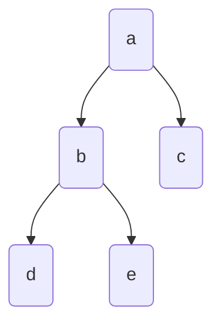

# 📋 Tree Demonstration

Conceptually, trees are made up of nodes, and they are synonymous; a tree is a node. In bigtree implementation, node
refers to the `Node` class, whereas tree refers to the `Tree` class. Tree is implemented as a wrapper around a Node to
implement tree-level methods for a more intuitive API.

Here are some codes to get started.

## Construct Tree

Nodes can have attributes if they are initialized from `Node`, *dictionary*, *pandas DataFrame*, or *polars DataFrame*.
Read more [here](/../../bigtree/tree/tree/#tree-construct-methods).

### 1. From Node

Nodes can be linked to each other in the following ways:

- Using `parent` and `children` setter methods
- Directly passing `parent` or `children` argument
- Using bitshift operator with the convention `parent >> child` or `child << parent`
- Using `.append(child)` or `.extend([child1, child2])` methods

=== "`parent` and `children` setter methods"
    ```python hl_lines="8-9"
    from bigtree import Node, Tree

    root = Node("a")
    b = Node("b")
    c = Node("c")
    d = Node("d")

    root.children = [b, c]
    d.parent = b

    tree = Tree(root)
    tree.show()
    # a
    # ├── b
    # │   └── d
    # └── c

    tree.hshow()
    #      ┌─ b ─── d
    # ─ a ─┤
    #      └─ c

    tree.vshow()
    #    ┌───┐
    #    │ a │
    #    └─┬─┘
    #   ┌──┴───┐
    # ┌─┴─┐  ┌─┴─┐
    # │ b │  │ c │
    # └─┬─┘  └───┘
    #   │
    # ┌─┴─┐
    # │ d │
    # └───┘

    graph = tree.to_dot(node_colour="gold")
    graph.write_png("assets/demo/tree.png")
    ```

=== "`parent` or `children` argument"
    ```python hl_lines="5-6"
    from bigtree import Node

    b = Node("b")
    c = Node("c")
    d = Node("d", parent=b)
    root = Node("a", children=[b, c])
    ```

=== "Bitshift operator"
    ```python hl_lines="8-10"
    from bigtree import Node

    root = Node("a")
    b = Node("b")
    c = Node("c")
    d = Node("d")

    root >> b
    root >> c
    d << b
    ```

=== "`append` and `extend`"
    ```python hl_lines="8-9"
    from bigtree import Node

    root = Node("a")
    b = Node("b")
    c = Node("c")
    d = Node("d")

    root.extend([b, c])
    b.append(d)
    ```


### 2. From str

Construct nodes only. Newick string notation supports parsing attributes.

=== "Tree string"
    ```python hl_lines="13"
    from bigtree import Tree

    tree_str = """
    a
    ├── b
    │   ├── d
    │   └── e
    │       ├── g
    │       └── h
    └── c
        └── f
    """
    tree = Tree.from_str(tree_str)

    tree.show()
    # a
    # ├── b
    # │   ├── d
    # │   └── e
    # │       ├── g
    # │       └── h
    # └── c
    #     └── f
    ```

=== "Newick string"
    ```python hl_lines="4"
    from bigtree import Tree

    newick_str = "((d,(g,h)e)b,(f)c)a"
    tree = Tree.from_newick(newick_str)

    tree.show()
    # a
    # ├── b
    # │   ├── d
    # │   └── e
    # │       ├── g
    # │       └── h
    # └── c
    #     └── f
    ```

### 3. From list

Construct nodes only. List can contain either <mark>full paths</mark> or tuples of <mark>parent-child names</mark>.

=== "Full paths"
    ```python hl_lines="3"
    from bigtree import Tree

    tree = Tree.from_list(["a/b/d", "a/c"])

    tree.show()
    # a
    # ├── b
    # │   └── d
    # └── c
    ```

=== "Parent-child names"
    ```python hl_lines="3"
    from bigtree import Tree

    tree = Tree.from_list_relation([("a", "b"), ("a", "c"), ("b", "d")])

    tree.show()
    # a
    # ├── b
    # │   └── d
    # └── c
    ```

### 4. From nested dictionary

Construct nodes with attributes. Dictionary can be in a <mark>flat structure</mark> where `key` is path and `value` is
dictionary of node attribute names and values, or in a <mark>recursive structure</mark> where `key` is node attribute
names and `value` is node attribute values, and list of children (recursive).

=== "Flat structure"
    ```python hl_lines="9"
    from bigtree import Tree

    path_dict = {
       "a": {"age": 90},
       "a/b": {"age": 65},
       "a/c": {"age": 60},
       "a/b/d": {"age": 40},
    }
    tree = Tree.from_dict(path_dict)

    tree.show(attr_list=["age"])
    # a [age=90]
    # ├── b [age=65]
    # │   └── d [age=40]
    # └── c [age=60]
    ```

=== "Recursive structure"
    ```python hl_lines="17"
    from bigtree import Tree

    nested_dict = {
       "name": "a",
       "age": 90,
       "children": [
          {
             "name": "b",
             "age": 65,
             "children": [
                {"name": "d", "age": 40},
             ],
          },
          {"name": "c", "age": 60},
       ],
    }
    tree = Tree.from_nested_dict(nested_dict)

    tree.show(attr_list=["age"])
    # a [age=90]
    # ├── b [age=65]
    # │   └── d [age=40]
    # └── c [age=60]
    ```

=== "Recursive structure by key"
    ```python hl_lines="17 31"
    from bigtree import Tree

    nested_dict = {
        "a": {
            "age": 90,
            "children": {
                "b": {
                    "age": 65,
                    "children": {
                        "d": {"age": 40},
                    },
                },
                "c": {"age": 60},
            },
        }
    }
    tree = Tree.from_nested_dict_key(nested_dict)

    tree.show(attr_list=["age"])
    # a [age=90]
    # ├── b [age=65]
    # │   └── d [age=40]
    # └── c [age=60]

    nested_dict = {
        "a": {
            "b": {"d": {}},
            "c": {},
        }
    }
    tree = Tree.from_nested_dict_key(nested_dict, child_key=None)

    tree.show()
    # a
    # ├── b
    # │   └── d
    # └── c
    ```


### 5. From pandas/polars DataFrame

Construct nodes with attributes. *DataFrame* can contain either <mark>path column</mark> or
<mark>parent-child columns</mark>. Other columns can be used to specify attributes.

=== "pandas - Path column"
    ```python hl_lines="14"
    import pandas as pd

    from bigtree import Tree

    data = pd.DataFrame(
       [
          ["a", 90],
          ["a/b", 65],
          ["a/c", 60],
          ["a/b/d", 40],
       ],
       columns=["path", "age"],
    )
    tree = Tree.from_dataframe(data)

    tree.show(attr_list=["age"])
    # a [age=90]
    # ├── b [age=65]
    # │   └── d [age=40]
    # └── c [age=60]
    ```

=== "pandas - Parent-child columns"
    ```python hl_lines="14"
    import pandas as pd

    from bigtree import Tree

    data = pd.DataFrame(
       [
          ["a", None, 90],
          ["b", "a", 65],
          ["c", "a", 60],
          ["d", "b", 40],
       ],
       columns=["child", "parent", "age"],
    )
    tree = Tree.from_dataframe_relation(data)

    tree.show(attr_list=["age"])
    # a [age=90]
    # ├── b [age=65]
    # │   └── d [age=40]
    # └── c [age=60]
    ```

=== "polars - Path column"
    ```python hl_lines="14"
    import polars as pl

    from bigtree import Tree

    data = pl.DataFrame(
       [
          ["a", 90],
          ["a/b", 65],
          ["a/c", 60],
          ["a/b/d", 40],
       ],
       schema=["path", "age"],
    )
    tree = Tree.from_polars(data)

    tree.show(attr_list=["age"])
    # a [age=90]
    # ├── b [age=65]
    # │   └── d [age=40]
    # └── c [age=60]
    ```

=== "polars - Parent-child columns"
    ```python hl_lines="14"
    import polars as pl

    from bigtree import Tree

    data = pl.DataFrame(
       [
          ["a", None, 90],
          ["b", "a", 65],
          ["c", "a", 60],
          ["d", "b", 40],
       ],
       schema=["child", "parent", "age"],
    )
    tree = Tree.from_polars_relation(data)

    tree.show(attr_list=["age"])
    # a [age=90]
    # ├── b [age=65]
    # │   └── d [age=40]
    # └── c [age=60]
    ```

### 6. From rich Trees

Convert rich.tree.Tree to bigtree Trees.

=== "rich"
    ```python hl_lines="10"
    from rich.tree import Tree as RichTree
    from rich.text import Text

    from bigtree import Tree

    rich_root = RichTree(Text("a", style="magenta"))
    b = rich_root.add(Text("b", style="red"))
    d = b.add("d")
    c = rich_root.add(Text("c", style="red"))
    tree = Tree.from_rich(rich_root)

    # Style does not show up in documentation
    tree.show(rich=True, node_format_attr="style")
    # a
    # ├── b
    # │   └── d
    # └── c
    ```

!!! note

    If tree is already created, nodes can still be added using path string, dictionary, and pandas/polars DataFrame!<br>
    Attributes can be added to existing nodes using a dictionary or pandas/polars DataFrame.

## View Tree

### 1. Print Tree

After tree is constructed, it can be viewed by printing to console using `show`, `hshow`, or `vshow` method directly,
for compact, horizontal, and vertical orientation respectively.

```python hl_lines="9 16 22"
from bigtree import Node, Tree

root = Node("a", alias="alias-a", age=90, gender="F")
b = Node("b", age=65, gender="M", parent=root)
c = Node("c", alias="alias-c", age=60, gender="M", parent=root)
d = Node("d", age=40, gender="F", parent=b)
e = Node("e", age=35, gender="M", parent=b)
tree = Tree(root)
tree.show() # (1)!
# a
# ├── b
# │   ├── d
# │   └── e
# └── c

tree.hshow() # (2)!
#            ┌─ d
#      ┌─ b ─┤
# ─ a ─┤     └─ e
#      └─ c

tree.vshow() # (3)!
#         ┌───┐
#         │ a │
#         └─┬─┘
#      ┌────┴─────┐
#    ┌─┴─┐      ┌─┴─┐
#    │ b │      │ c │
#    └─┬─┘      └───┘
#   ┌──┴───┐
# ┌─┴─┐  ┌─┴─┐
# │ d │  │ e │
# └───┘  └───┘
```

1. Alternatively, `print_tree(tree.root)` can be used
2. Alternatively, `hprint_tree(tree.root)` can be used
3. Alternatively, `vprint_tree(tree.root)` can be used

Other customisations for printing are also available, such as:

- Printing alias instead of node name, if present
- Printing subtree
- Printing tree with attributes
- Different built-in or custom style and border style
- Colours and icons using rich rendering

=== "Alias"
    ```python hl_lines="1"
    tree.show(alias="alias")
    # alias-a
    # ├── b
    # │   ├── d
    # │   └── e
    # └── alias-c
    ```
=== "Subtree"
    ```python hl_lines="1 6"
    tree.show(node_name_or_path="b")
    # b
    # ├── d
    # └── e

    tree.show(max_depth=2)
    # a
    # ├── b
    # └── c
    ```
=== "Tree with attributes"
    ```python hl_lines="1 8 15 22"
    tree.show(attr_list=["age"])
    # a [age=90]
    # ├── b [age=65]
    # │   ├── d [age=40]
    # │   └── e [age=35]
    # └── c [age=60]

    tree.show(attr_list=["age", "gender"], attr_format="{k}:{v}", attr_sep="; ")
    # a [age:90; gender:F]
    # ├── b [age:65; gender:M]
    # │   ├── d [age:40; gender:F]
    # │   └── e [age:35; gender:M]
    # └── c [age:60; gender:M]

    tree.show(attr_list=["age"], attr_bracket=["*(", ")*"])
    # a *(age=90)*
    # ├── b *(age=65)*
    # │   ├── d *(age=40)*
    # │   └── e *(age=35)*
    # └── c *(age=60)*

    tree.show(all_attrs=True)
    # a [age=90, gender=F]
    # ├── b [age=65, gender=M]
    # │   ├── d [age=40, gender=F]
    # │   └── e [age=35, gender=M]
    # └── c [age=60, gender=M]
    ```
=== "Built-in style"
    ```python hl_lines="1 8 15 22 29 36"
    tree.show(style="ansi")
    # a
    # |-- b
    # |   |-- d
    # |   `-- e
    # `-- c

    tree.show(style="ascii")
    # a
    # |-- b
    # |   |-- d
    # |   +-- e
    # +-- c

    tree.show(style="const")
    # a
    # ├── b
    # │   ├── d
    # │   └── e
    # └── c

    tree.show(style="const_bold")
    # a
    # ┣━━ b
    # ┃   ┣━━ d
    # ┃   ┗━━ e
    # ┗━━ c

    tree.show(style="rounded")
    # a
    # ├── b
    # │   ├── d
    # │   ╰── e
    # ╰── c

    tree.show(style="double")
    # a
    # ╠══ b
    # ║   ╠══ d
    # ║   ╚══ e
    # ╚══ c
    ```
=== "Custom style"
    ```python hl_lines="1"
    tree.show(style=("│  ", "├→ ", "╰→ "))
    # a
    # ├→ b
    # │  ├→ d
    # │  ╰→ e
    # ╰→ c
    ```
=== "Rich Render"
    ```python hl_lines="2"
    # Style does not show up in documentation
    tree.show(rich=True, node_format="bold magenta", edge_format="blue")
    # a
    # ├── b
    # │   ├── d
    # │   └── e
    # └── c
    ```

### 2. Display on Jupyter Notebook

Tree can be displayed interactively on jupyter notebook using `ishow`.

```python hl_lines="9"
from bigtree import Node, Tree

root = Node("a", age=90, gender="F")
b = Node("b", age=65, gender="M", parent=root)
c = Node("c", age=60, gender="M", parent=root)
d = Node("d", age=40, gender="F", parent=b)
e = Node("e", age=35, gender="M", parent=b)
tree = Tree(root)
tree.ishow(all_attrs=True, height=400) # (1)!
```

1. Alternatively, `iprint_tree(tree.root)` can be used

<div style="background-color: white;">
<script src="https://cdnjs.cloudflare.com/ajax/libs/vis-network/9.1.2/dist/vis-network.min.js" integrity="sha512-LnvoEWDFrqGHlHmDD2101OrLcbsfkrzoSpvtSQtxK3RMnRV0eOkhhBN2dXHKRrUU8p2DGRTk35n4O8nWSVe1mQ==" crossorigin="anonymous" referrerpolicy="no-referrer"></script>

</div>


### 3. Plot Tree

Tree can also be plotted using `plot` method directly with the help of `matplotlib` library.

Arguments and keyword arguments can be passed in as long as they are compatible with the `plt.plot()`
function. A *plt.Figure* object is returned if you want to do further customisations such as add title or
save the figure to image.

```python hl_lines="10-11"
from bigtree import Node, Tree

root = Node("a", age=90, gender="F")
b = Node("b", age=65, gender="M", parent=root)
c = Node("c", age=60, gender="M", parent=root)
d = Node("d", age=40, gender="F", parent=b)
e = Node("e", age=35, gender="M", parent=b)
tree = Tree(root)

fig = tree.plot("-ok") # (1)!
fig.axes[0].set_title("Tree Plot Demonstration")

fig.show()  # Show figure
fig.savefig("assets/demo/tree_plot.png")  # Save figure
```

1. Alternatively, `plot_tree(tree.node, "-ok")` can be used


## Tree Attributes and Operations

Note that using `BaseNode` or `Node` as superclass inherits the default class attributes (properties)
and operations (methods).

```python
from bigtree import Tree

# Initialize tree
tree_str = """
a
├── b
│   ├── d
│   ├── e
│   └── f
│       ├── h
│       └── i
└── c
    └── g
"""
root = Tree.from_str(tree_str).node

# Accessing children
node_b = root["b"]
node_e = root["b"]["e"]
```

Below are the tables of attributes available to `BaseNode` and `Node` classes.

| Attributes wrt self                  | Code               | Returns                    |
|--------------------------------------|--------------------|----------------------------|
| Check if root                        | `root.is_root`     | True                       |
| Check if leaf node                   | `root.is_leaf`     | False                      |
| Check diameter of tree               | `node_b.diameter`  | 3                          |
| Check depth of node                  | `node_b.depth`     | 2                          |
| Check depth of tree                  | `node_b.max_depth` | 4                          |
| Get root of tree                     | `node_b.root`      | Node(/a, )                 |
| Get node path                        | `node_b.node_path` | (Node(/a, ), Node(/a/b, )) |
| Get node name (only for `Node`)      | `node_b.node_name` | 'b'                        |
| Get node path name (only for `Node`) | `node_b.path_name` | '/a/b'                     |

| Attributes wrt structure          | Code                       | Returns                                                                              |
|-----------------------------------|----------------------------|--------------------------------------------------------------------------------------|
| Get child/children                | `root.children`            | (Node(/a/b, ), Node(/a/c, ))                                                         |
| Get parent                        | `node_e.parent`            | Node(/a/b, )                                                                         |
| Get siblings                      | `node_e.siblings`          | (Node(/a/b/d, ), Node(/a/b/f, ))                                                     |
| Get left sibling                  | `node_e.left_sibling`      | Node(/a/b/d, )                                                                       |
| Get right sibling                 | `node_e.right_sibling`     | Node(/a/b/f, )                                                                       |
| Get ancestors (lazy evaluation)   | `list(node_e.ancestors)`   | [Node(/a/b, ), Node(/a, )]                                                           |
| Get descendants (lazy evaluation) | `list(node_b.descendants)` | [Node(/a/b/d, ), Node(/a/b/e, ), Node(/a/b/f, ), Node(/a/b/f/h, ), Node(/a/b/f/i, )] |
| Get leaves (lazy evaluation)      | `list(node_b.leaves)`      | [Node(/a/b/d, ), Node(/a/b/e, ), Node(/a/b/f/h, ), Node(/a/b/f/i, )]                 |

Below is the table of operations available to `BaseNode` and `Node` classes.

| Operations                         | Code                                                             | Returns                                    |
|------------------------------------|------------------------------------------------------------------|--------------------------------------------|
| Visualize tree (only for `Node`)   | `root.show()` / `root.hshow()` / `root.vshow()`                  | None                                       |
| Get node information               | `root.describe(exclude_prefix="_")`                              | [('name', 'a')]                            |
| Find path from one node to another | `root.go_to(node_e)`                                             | [Node(/a, ), Node(/a/b, ), Node(/a/b/e, )] |
| Add one or more children to node   | `root.append(Node("j"))` / `root.extend([Node("k"), Node("l")])` | Node(/a, )                                 |
| Set attribute(s)                   | `root.set_attrs({"description": "root-tag"})`                    | None                                       |
| Get attribute                      | `root.get_attr("description")`                                   | 'root-tag'                                 |
| Copy tree                          | `root.copy()`                                                    | None                                       |
| Sort children                      | `root.sort(key=lambda node: node.node_name, reverse=True)`       | None                                       |
| Plot tree                          | `root.plot("-ok")`                                               | plt.Figure()                               |
| Query tree                         | `root.query('name == "b"')`                                      | [Node(/a/b, )]                             |

## Traverse Tree

Tree can be traversed using the following traversal methods.

```python hl_lines="11 14 17 20-23 26 29-32"
from bigtree import Tree

tree = Tree.from_str("""
a
├── b
│   ├── d
│   └── e
└── c
""")

[node.node_name for node in tree.preorder_iter()]
# ['a', 'b', 'd', 'e', 'c']

[node.node_name for node in tree.postorder_iter()]
# ['d', 'e', 'b', 'c', 'a']

[node.node_name for node in tree.levelorder_iter()]
# ['a', 'b', 'c', 'd', 'e']

[
    [node.node_name for node in node_group]
    for node_group in tree.levelordergroup_iter()
]
# [['a'], ['b', 'c'], ['d', 'e']]

[node.node_name for node in tree.zigzag_iter()]
# ['a', 'c', 'b', 'd', 'e']

[
    [node.node_name for node in node_group]
    for node_group in tree.zigzaggroup_iter()
]
# [['a'], ['c', 'b'], ['d', 'e']]
```

## Modify Tree

Nodes can be <mark>shifted</mark> (with or without replacement) or <mark>copied</mark> (without replacement)
from one path to another, this changes the tree in-place.
Nodes can also be copied (with or without replacement) <mark>between two different trees</mark>.

There are various other configurations for performing copying/shifting, refer to [code documentation](../../bigtree/tree/modify.md)
for more examples.

=== "Shift nodes"
```python hl_lines="12-16 24-28"
from bigtree import Tree, shift_nodes, shift_and_replace_nodes

root = Tree.from_list(
    ["Downloads/Pictures", "Downloads/photo1.jpg", "Downloads/file1.doc"]
).node
root.show()
# Downloads
# ├── Pictures
# ├── photo1.jpg
# └── file1.doc

shift_nodes(
   tree=root,
   from_paths=["photo1.jpg", "Downloads/file1.doc"],
   to_paths=["Downloads/Pictures/photo1.jpg", "Downloads/Files/file1.doc"],
)
root.show()
# Downloads
# ├── Pictures
# │   └── photo1.jpg (1)
# └── Files
#     └── file1.doc (2)

shift_and_replace_nodes(
   tree=root,
   from_paths=["Downloads/Files"],
   to_paths=["Downloads/Pictures/photo1.jpg"],
)
root.show()
# Downloads
# └── Pictures
#     └── Files (3)
#         └── file1.doc
```

1. The first shift to destination `Downloads/Pictures/photo1.jpg`
2. The second shift to destination `Downloads/Files/file1.doc`, this creates intermediate Node `Files` as well
3. Shift and replace `photo1.jpg` with `Files` folder

=== "Copy nodes"
```python hl_lines="12-16"
from bigtree import Tree, copy_nodes

root = Tree.from_list(
    ["Downloads/Pictures", "Downloads/photo1.jpg", "Downloads/file1.doc"]
).node
root.show()
# Downloads
# ├── Pictures
# ├── photo1.jpg
# └── file1.doc

copy_nodes(
   tree=root,
   from_paths=["photo1.jpg", "Downloads/file1.doc"],
   to_paths=["Downloads/Pictures/photo1.jpg", "Downloads/Files/file1.doc"],
)
root.show()
# Downloads
# ├── Pictures
# │   └── photo1.jpg (1)
# ├── photo1.jpg (2)
# ├── file1.doc (4)
# └── Files
#     └── file1.doc (3)
```

1. The first copy to destination `Downloads/Pictures/photo1.jpg`
2. Original `photo1.jpg` still remains
3. The second copy to destination `Downloads/Files/file1.doc`, this creates intermediate Node `Files` as well
4. Original `file1.doc` still remains

=== "Copy nodes between two trees"
```python hl_lines="18-27 42-47"
from bigtree import (
    Node,
    Tree,
    copy_nodes_from_tree_to_tree,
    copy_and_replace_nodes_from_tree_to_tree,
)

root = Tree.from_list(
    ["Downloads/Pictures", "Downloads/photo1.jpg", "Downloads/file1.doc"]
).node
root.show()
# Downloads
# ├── Pictures
# ├── photo1.jpg
# └── file1.doc

root_other = Node("Documents")
copy_nodes_from_tree_to_tree(
    from_tree=root,
    to_tree=root_other,
    from_paths=["Downloads/Pictures", "photo1.jpg", "file1.doc"],
    to_paths=[
        "Documents/Pictures",
        "Documents/Pictures/photo1.jpg",
        "Documents/Files/file1.doc",
    ],
)
root_other.show()
# Documents
# ├── Pictures (1)
# │   └── photo1.jpg (2)
# └── Files
#     └── file1.doc (3)

root_other = Tree.from_str("""
Documents
├── Pictures
│   └── photo2.jpg
└── file2.doc
""").node

copy_and_replace_nodes_from_tree_to_tree(
    from_tree=root,
    to_tree=root_other,
    from_paths=["Downloads/photo1.jpg", "Downloads/file1.doc"],
    to_paths=["Documents/Pictures/photo2.jpg", "Documents/file2.doc"],
)
root_other.show()
# Documents
# ├── Pictures
# │   └── photo1.jpg (4)
# └── file1.doc (5)
```

1. The first copy to destination `Documents/Pictures`
2. The second copy to destination `Documents/Pictures/photo1.jpg`
3. The third copy to destination `Documents/Files/file1.doc`, this creates intermediate Node `Files` as well
4. The first copy and replace of `Documents/Pictures/photo2.jpg` with `photo1.jpg`
5. The second copy and replace of `Documents/file2.doc` with `file1.doc`

## Tree Search

One or multiple nodes can be searched based on name, path, attribute value, or user-defined condition.
It is also possible to search for one or more child node(s) based on attributes, this search will be faster as
it does not require traversing the whole tree to find the node(s).

Read more [here](/../../bigtree/tree/tree/#tree-query-and-search-methods).

=== "Find single node"
    ```python hl_lines="13 16 19 22 25 28"
    from bigtree import Node, Tree
    root = Node("a", age=90)
    b = Node("b", age=65, parent=root)
    c = Node("c", age=60, parent=root)
    d = Node("d", age=40, parent=c)
    tree = Tree(root)
    tree.show(attr_list=["age"])
    # a [age=90]
    # ├── b [age=65]
    # └── c [age=60]
    #     └── d [age=40]

    tree.find(lambda node: node.age == 60)
    # Node(/a/c, age=60)

    tree.find_name("d")
    # Node(/a/c/d, age=40)

    tree["c"].find_relative_path("../b")  # relative path
    # Node(/a/b, age=65)

    tree.find_path("/c/d")  # partial path
    # Node(/a/c/d, age=40)

    tree.find_full_path("a/c/d")  # full path
    # Node(/a/c/d, age=40)

    tree.find_attr("age", 40)
    # Node(/a/c/d, age=40)
    ```

=== "Find multiple nodes"
    ```python hl_lines="13 16 19 22 25"
    from bigtree import Node, Tree
    root = Node("a", age=90)
    b = Node("b", age=65, parent=root)
    c = Node("c", age=60, parent=root)
    d = Node("c", age=40, parent=c)
    tree = Tree(root)
    tree.show(attr_list=["age"])
    # a [age=90]
    # ├── b [age=65]
    # └── c [age=60]
    #     └── c [age=40]

    tree.findall(lambda node: node.age >= 65)
    # (Node(/a, age=90), Node(/a/b, age=65))

    tree.find_names("c")
    # (Node(/a/c, age=60), Node(/a/c/c, age=40))

    tree["c"].find_relative_paths("../*")  # relative path
    # (Node(/a/b, age=65), Node(/a/c, age=60))

    tree.find_paths("/c")  # partial path
    # (Node(/a/c, age=60), Node(/a/c/c, age=40))

    tree.find_attrs("age", 40)
    # (Node(/a/c/c, age=40),)
    ```

=== "Find child nodes"
    ```python hl_lines="13 16 19 22"
    from bigtree import Node, Tree
    root = Node("a", age=90)
    b = Node("b", age=65, parent=root)
    c = Node("c", age=60, parent=root)
    d = Node("c", age=40, parent=c)
    tree = Tree(root)
    tree.show(attr_list=["age"])
    # a [age=90]
    # ├── b [age=65]
    # └── c [age=60]
    #     └── c [age=40]

    tree.find_children(lambda node: node.age >= 60)
    # (Node(/a/b, age=65), Node(/a/c, age=60))

    tree.find_child(lambda node: node.node_name == "c")
    # Node(/a/c, age=60)

    tree.find_child_by_name("c")
    # Node(/a/c, age=60)

    tree["c"].find_child_by_name("c")
    # Node(/a/c/c, age=40)
    ```

## Helper Utility

Read more [here](/../../bigtree/tree/tree/#tree-helper-methods).

### 1. Clone tree

Trees can be cloned to another Node type. If the same type is desired, use `tree.copy()` instead.

```python hl_lines="6"
from bigtree import BaseNode, Node, clone_tree

root = BaseNode(name="a")
b = BaseNode(name="b", parent=root)

clone_tree(root, Node)  # clone from `BaseNode` to `Node` type
# Node(/a, )
```

### 2. Get subtree

Subtree refers to a smaller tree with a different tree root.

```python hl_lines="12"
from bigtree import str_to_tree, get_subtree

root = str_to_tree("""
a
├── b
│   ├── d
│   └── e
└── c
    └── f
""")

root_subtree = get_subtree(root, "b")
root_subtree.show()
# b
# ├── d
# └── e
```

### 3. Prune tree

Pruned tree refers to a smaller tree with the same tree root. Trees can be pruned by one or more of the following filters:

- Path: keep all descendants by default, set `exact=True` to prune the path exactly
- Depth: prune tree by depth

=== "Prune by path"
    ```python hl_lines="12"
    from bigtree import Tree

    tree = Tree.from_str("""
    a
    ├── b
    │   ├── d
    │   └── e
    └── c
        └── f
    """)

    tree_pruned = tree.prune("a/b")
    tree_pruned.show()
    # a
    # └── b
    #     ├── d
    #     └── e
    ```
=== "Prune by exact path"
    ```python hl_lines="12"
    from bigtree import Tree

    tree = Tree.from_str("""
    a
    ├── b
    │   ├── d
    │   └── e
    └── c
        └── f
    """)

    tree_pruned = tree.prune("a/b", exact=True)
    tree_pruned.show()
    # a
    # └── b
    ```
=== "Prune by depth"
    ```python hl_lines="12"
    from bigtree import Tree

    tree = Tree.from_str("""
    a
    ├── b
    │   ├── d
    │   └── e
    └── c
        └── f
    """)

    tree_pruned = tree.prune("c", max_depth=2)
    tree_pruned.show()
    # a
    # └── c
    ```

### 4. Get tree differences

View the differences in structure and/or attributes between two trees.  The changes reflected are relative to the first
tree. By default, only the differences are shown. It is possible to view the full original tree with the differences.

To compare tree attributes:

- `(+)`: Node is added in second tree
- `(-)`: Node is removed in second tree
- `(~)`: Node has different attributes, only available when comparing attributes

For more details, `(moved from)`, `(moved to)`, `(added)`, and `(removed)` can be indicated instead if `(+)` and `(-)`
by passing `detail=True`.

For aggregating the differences at the parent-level instead of having `(+)` and `(-)` at every child node, pass in
`aggregate=True`. This is useful if subtrees are shifted, and if you want to view the shifting at the parent-level.

!!! note

    For more custom processing and handling of the tree differences, the interim
    dataframe of the tree differences can be retrieved with `get_tree_diff_dataframe`.

=== "Only differences"
    ```python hl_lines="20"
    from bigtree import Tree

    tree = Tree.from_str("""
    a
    ├── b
    │   ├── d
    │   └── e
    └── c
        └── f
    """)

    tree_other = Tree.from_str("""
    a
    ├── b
    │   └── d
    └── c
        └── g
    """)

    tree_diff = tree.diff(tree_other)
    tree_diff.show()
    # a
    # ├── b
    # │   └── e (-)
    # └── c
    #     ├── f (-)
    #     └── g (+)
    ```
=== "Full original tree"
    ```python hl_lines="20"
    from bigtree import Tree

    tree = Tree.from_str("""
    a
    ├── b
    │   ├── d
    │   └── e
    └── c
        └── f
    """)

    tree_other = Tree.from_str("""
    a
    ├── b
    │   └── d
    └── c
        └── g
    """)

    tree_diff = tree.diff(tree_other, only_diff=False)
    tree_diff.show()
    # a
    # ├── b
    # │   ├── d
    # │   └── e (-)
    # └── c
    #     ├── f (-)
    #     └── g (+)
    ```
=== "With details"
    ```python hl_lines="23"
    from bigtree import Tree

    tree = Tree.from_str("""
    a
    ├── b
    │   ├── d
    │   │   └── g
    │   └── e
    └── c
        └── f
    """)

    tree_other = Tree.from_str("""
    a
    ├── b
    │   └── h
    └── c
        ├── d
        │   └── g
        └── f
    """)

    tree_diff = tree.diff(tree_other, detail=True)
    tree_diff.show()
    # a
    # ├── b
    # │   ├── d (moved from)
    # │   │   └── g (moved from)
    # │   ├── e (removed)
    # │   └── h (added)
    # └── c
    #     └── d (moved to)
    #         └── g (moved to)
    ```
=== "With aggregated differences"
    ```python hl_lines="23"
    from bigtree import Tree

    tree = Tree.from_str("""
    a
    ├── b
    │   ├── d
    │   │   └── g
    │   └── e
    └── c
        └── f
    """)

    tree_other = Tree.from_str("""
    a
    ├── b
    │   └── h
    └── c
        ├── d
        │   └── g
        └── f
    """)

    tree_diff = tree.diff(tree_other, detail=True, aggregate=True)
    tree_diff.show()
    # a
    # ├── b
    # │   ├── d (moved from)
    # │   │   └── g
    # │   ├── e (removed)
    # │   └── h (added)
    # └── c
    #     └── d (moved to)
    #         └── g
    ```
=== "Attribute difference"
    ```python hl_lines="27"
    from bigtree import Node, Tree

    root = Node("a")
    b = Node("b", parent=root)
    c = Node("c", tags="original c", parent=b)
    d = Node("d", tags="original d", parent=root)
    tree = Tree(root)
    tree.show(attr_list=["tags"])
    # a
    # ├── b
    # │   └── c [tags=original c]
    # └── d [tags=original d]

    root_other = Node("a")
    b = Node("b", parent=root_other)
    c = Node("c", tags="new c", parent=b)
    e = Node("e", tags="new e", parent=b)
    d = Node("d", tags="new d", parent=root_other)
    tree_other = Tree(root_other)
    tree_other.show(attr_list=["tags"])
    # a
    # ├── b
    # │   ├── c [tags=new c]
    # │   └── e [tags=new e]
    # └── d [tags=new d]

    tree_diff = tree.diff(tree_other, attr_list=["tags"])
    tree_diff.show(attr_list=["tags"])
    # a
    # ├── b
    # │   ├── c (~) [tags=('original c', 'new c')]
    # │   └── e (+)
    # └── d (~) [tags=('original d', 'new d')]
    ```

## Export Tree

Tree can be exported to other data types:

1. HTML, newick string notation
2. Nested dictionary (flat structure and recursive structure)
3. pandas DataFrame
4. polars DataFrame
5. Dot (can save to .dot, .png, .svg, .jpeg files)
6. Pillow (can save to .png, .jpg)
7. Mermaid Flowchart (can display on .md)
8. Pyvis Network (can display interactive .html)

Read more [here](/../../bigtree/tree/tree/#tree-export-methods).

```python
from bigtree import Node, Tree

root = Node("a", age=90)
b = Node("b", age=65, parent=root)
c = Node("c", age=60, parent=root)
d = Node("d", age=40, parent=b)
e = Node("e", age=35, parent=b)
tree = Tree(root)
tree.show()
# a
# ├── b
# │   ├── d
# │   └── e
# └── c
```

=== "HTML"
    ```python hl_lines="1"
    tree.to_html()
    ```

=== "Newick string notation"
    ```python hl_lines="1 4"
    tree.to_newick()
    # '((d,e)b,c)a'

    tree.to_newick(attr_list=["age"])
    # '((d[&&NHX:age=40],e[&&NHX:age=35])b[&&NHX:age=65],c[&&NHX:age=60])a[&&NHX:age=90]'
    ```

=== "Dictionary (flat structure)"
    ```python hl_lines="1-5"
    tree.to_dict(
       name_key="name",
       parent_key="parent",
       attr_dict={"age": "person age"}
    )
    # {
    #    '/a': {'name': 'a', 'parent': None, 'person age': 90},
    #    '/a/b': {'name': 'b', 'parent': 'a', 'person age': 65},
    #    '/a/b/d': {'name': 'd', 'parent': 'b', 'person age': 40},
    #    '/a/b/e': {'name': 'e', 'parent': 'b', 'person age': 35},
    #    '/a/c': {'name': 'c', 'parent': 'a', 'person age': 60}
    # }
    ```

=== "Dictionary (recursive structure)"
    ```python hl_lines="1"
    tree.to_nested_dict(all_attrs=True)
    # {
    #    'name': 'a',
    #    'age': 90,
    #    'children': [
    #       {
    #          'name': 'b',
    #          'age': 65,
    #          'children': [
    #             {
    #                'name': 'd',
    #                'age': 40
    #             },
    #             {
    #                'name': 'e',
    #                'age': 35
    #             }
    #          ]
    #       },
    #       {
    #          'name': 'c',
    #          'age': 60
    #       }
    #    ]
    # }
    ```

=== "Dictionary (recursive structure by key)"
    ```python hl_lines="1 7"
    tree.to_nested_dict_key(all_attrs=True)
    # {'a': {'age': 90,
    #        'children': {'b': {'age': 65,
    #                           'children': {'d': {'age': 40}, 'e': {'age': 35}}},
    #                     'c': {'age': 60}}}}

    tree.to_nested_dict_key(child_key=None)
    # {'a': {'b': {'d': {}, 'e': {}}, 'c': {}}}
    ```

=== "pandas DataFrame"
    ```python hl_lines="1-6"
    tree.to_dataframe(
       name_col="name",
       parent_col="parent",
       path_col="path",
       attr_dict={"age": "person age"}
    )
    #      path name parent  person age
    # 0      /a    a   None          90
    # 1    /a/b    b      a          65
    # 2  /a/b/d    d      b          40
    # 3  /a/b/e    e      b          35
    # 4    /a/c    c      a          60
    ```

=== "polars DataFrame"
    ```python hl_lines="1-6"
    tree.to_polars(
       name_col="name",
       parent_col="parent",
       path_col="path",
       attr_dict={"age": "person age"}
    )
    # shape: (5, 4)
    # ┌────────┬──────┬────────┬────────────┐
    # │ path   ┆ name ┆ parent ┆ person age │
    # │ ---    ┆ ---  ┆ ---    ┆ ---        │
    # │ str    ┆ str  ┆ str    ┆ i64        │
    # ╞════════╪══════╪════════╪════════════╡
    # │ /a     ┆ a    ┆ null   ┆ 90         │
    # │ /a/b   ┆ b    ┆ a      ┆ 65         │
    # │ /a/b/d ┆ d    ┆ b      ┆ 40         │
    # │ /a/b/e ┆ e    ┆ b      ┆ 35         │
    # │ /a/c   ┆ c    ┆ a      ┆ 60         │
    # └────────┴──────┴────────┴────────────┘
    ```

=== "Dot"
    ```python hl_lines="1"
    graph = tree.to_dot(node_colour="gold")
    graph.write_png("assets/demo/dot.png")
    ```

=== "Pillow Graph"
    ```python hl_lines="1"
    pillow_image = tree.to_pillow_graph(node_content="{node_name}\nAge {age}")
    pillow_image.save("assets/demo/pillow_graph.png")
    ```

=== "Pillow"
    ```python hl_lines="1"
    pillow_image = tree.to_pillow()
    pillow_image.save("assets/demo/pillow.png")
    ```

=== "Mermaid Flowchart"
    ```python hl_lines="1"
    mermaid_md = tree.to_mermaid()
    print(mermaid_md)
    ```

=== "Pyvis Network"
    ```python hl_lines="1"
    net = tree.to_vis()
    net.save_graph("assets/demo/vis.html")
    ```

- dot.png


- pillow_graph.png


- pillow.png


- Mermaid flowchart

```mermaid
%%{ init: { 'flowchart': { 'curve': 'basis' } } }%%
flowchart TB
0("a") --> 0-0("b")
0-0 --> 0-0-0("d")
0-0 --> 0-0-1("e")
0("a") --> 0-1("c")
classDef default stroke-width:1
```

- Pyvis network

<div style="background-color: white;">
<script src="https://cdnjs.cloudflare.com/ajax/libs/vis-network/9.1.2/dist/vis-network.min.js" integrity="sha512-LnvoEWDFrqGHlHmDD2101OrLcbsfkrzoSpvtSQtxK3RMnRV0eOkhhBN2dXHKRrUU8p2DGRTk35n4O8nWSVe1mQ==" crossorigin="anonymous" referrerpolicy="no-referrer"></script>

</div>
