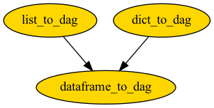

Construct
=================

Construct Directed Acyclic Graph (DAG) from list, dictionary, and pandas DataFrame.

.. list-table:: DAG Construct Methods
   :widths: 30 40 30
   :header-rows: 1

   * - Construct DAG from
     - Using parent-child relation
     - Add node attributes
   * - List
     - `list_to_dag`
     - No
   * - Dictionary
     - `dict_to_dag`
     - Yes
   * - DataFrame
     - `dataframe_to_dag`
     - Yes

The functions have the following dependency,

.. automodule:: bigtree.dag.construct
   :members:
   :show-inheritance:
