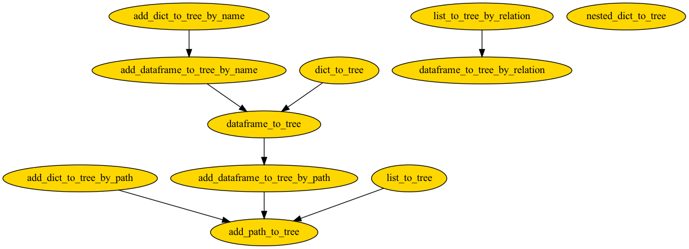

Construct
=================

Construct Tree from list, dictionary, and pandas DataFrame.

.. list-table:: Tree Construct Methods
   :widths: 35 30 50 40
   :header-rows: 1

   * - Construct DAG from
     - Using full path
     - Using parent-child relation
     - Add node attributes
   * - List
     - `list_to_tree`
     - `list_to_tree_by_relation`
     - No
   * - Dictionary
     - `dict_to_tree`
     - `nested_dict_to_tree`
     - Yes
   * - DataFrame
     - `dataframe_to_tree`
     - `dataframe_to_tree_by_relation`
     - Yes

To add attributes to existing tree,

.. list-table:: Tree Add Attributes Methods
   :widths: 30 40 30
   :header-rows: 1

   * - Construct DAG from
     - Using full path
     - Using node name
   * - Dictionary
     - `add_dict_to_tree_by_path`
     - `add_dict_to_tree_by_name`
   * - DataFrame
     - `add_dataframe_to_tree_by_path`
     - `add_dataframe_to_tree_by_name`

The functions have the following dependency,

.. automodule:: bigtree.tree.construct
   :members:
   :show-inheritance:
