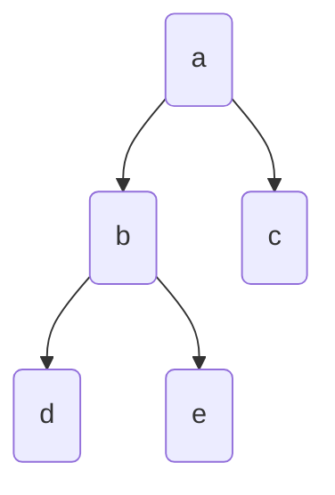

# 📋 Tree Demonstration

Here are some codes to get started.

## Construct Tree

Nodes can have attributes if they are initialized from `Node`, *dictionary*, or *pandas DataFrame*.

### 1. From Node

Nodes can be linked to each other in the following ways:
  - Using `parent` and `children` setter methods
  - Directly passing `parent` or `children` argument
  - Using bitshift operator with the convention `parent >> child` or `child << parent`
  - Using `.append(child)` or `.extend([child1, child2])` methods

{emphasize-lines="8-9"}
```python
from bigtree import Node, tree_to_dot

root = Node("a")
b = Node("b")
c = Node("c")
d = Node("d")

root.children = [b, c]
d.parent = b

root.show()
# a
# ├── b
# │   └── d
# └── c

root.hshow()
#      ┌─ b ─── d
# ─ a ─┤
#      └─ c

graph = tree_to_dot(root, node_colour="gold")
graph.write_png("assets/demo/tree.png")
```


{emphasize-lines="8-10"}
```python
from bigtree import Node

root = Node("a")
b = Node("b")
c = Node("c")
d = Node("d")

root >> b
root >> c
d << b

root.show()
# a
# ├── b
# │   └── d
# └── c
```

Alternatively, we can directly pass `parent` or `children` argument.

{emphasize-lines="5-6"}
```python
from bigtree import Node

b = Node("b")
c = Node("c")
d = Node("d", parent=b)
root = Node("a", children=[b, c])

root.show(style="ascii")
# a
# |-- b
# |   +-- d
# +-- c
```

### 2. From str

Construct nodes only. Newick string notation supports parsing attributes.

{emphasize-lines="13,25"}
```python
from bigtree import str_to_tree, newick_to_tree

tree_str = """
a
├── b
│   ├── d
│   └── e
│       ├── g
│       └── h
└── c
    └── f
"""
root = str_to_tree(tree_str)
root.show()
# a
# ├── b
# │   ├── d
# │   └── e
# │       ├── g
# │       └── h
# └── c
#     └── f

newick_str = "((d,(g,h)e)b,(f)c)a"
root = newick_to_tree(newick_str)
root.show()
# a
# ├── b
# │   ├── d
# │   └── e
# │       ├── g
# │       └── h
# └── c
#     └── f
```

### 3. From list

Construct nodes only, list can contain either full paths or tuples of parent-child names.

{emphasize-lines="3,10"}
```python
from bigtree import list_to_tree, list_to_tree_by_relation

root = list_to_tree(["a/b/d", "a/c"])
root.show()
# a
# ├── b
# │   └── d
# └── c

root = list_to_tree_by_relation([("a", "b"), ("a", "c"), ("b", "d")])
root.show()
# a
# ├── b
# │   └── d
# └── c
```

### 4. From nested dictionary

Construct nodes using path where `key` is path and `value` is dict of node attribute names and attribute values.
Dictionary can also be a recursive structure where `key` is node attribute names and `value` is node attribute values,
and list of children (recursive).

{emphasize-lines="10,32"}
```python
from bigtree import dict_to_tree, nested_dict_to_tree

path_dict = {
   "a": {"age": 90},
   "a/b": {"age": 65},
   "a/c": {"age": 60},
   "a/b/d": {"age": 40},
}

root = dict_to_tree(path_dict)
root.show(attr_list=["age"])
# a [age=90]
# ├── b [age=65]
# │   └── d [age=40]
# └── c [age=60]

path_dict = {
   "name": "a",
   "age": 90,
   "children": [
      {
         "name": "b",
         "age": 65,
         "children": [
            {"name": "d", "age": 40},
         ],
      },
      {"name": "c", "age": 60},
   ],
}

root = nested_dict_to_tree(path_dict)
root.show(attr_list=["age"])
# a [age=90]
# ├── b [age=65]
# │   └── d [age=40]
# └── c [age=60]
```

### 5. From pandas DataFrame

Construct nodes with attributes, *pandas DataFrame* can contain either path column or parent-child columns,
and attribute columns.

{emphasize-lines="15,32"}
```python
import pandas as pd

from bigtree import dataframe_to_tree, dataframe_to_tree_by_relation

data = pd.DataFrame(
   [
      ["a", 90],
      ["a/b", 65],
      ["a/c", 60],
      ["a/b/d", 40],
   ],
   columns=["path", "age"],
)

root = dataframe_to_tree(data)
root.show(attr_list=["age"])
# a [age=90]
# ├── b [age=65]
# │   └── d [age=40]
# └── c [age=60]

data = pd.DataFrame(
   [
      ["a", None, 90],
      ["b", "a", 65],
      ["c", "a", 60],
      ["d", "b", 40],
   ],
   columns=["child", "parent", "age"],
)

root = dataframe_to_tree_by_relation(data)
root.show(attr_list=["age"])
# a [age=90]
# ├── b [age=65]
# │   └── d [age=40]
# └── c [age=60]
```

> If tree is already created, nodes can still be added using path string, dictionary, and pandas DataFrame!
> Attributes can be added to existing nodes using a dictionary or pandas DataFrame.

## Print Tree

After tree is constructed, it can be viewed by printing to console using `show` or `hshow` method directly,
for vertical and horizontal orientation respectively.
Alternatively, the `print_tree` or `hprint_tree` method can be used.

{emphasize-lines="8,15,22,27,33,40,47,55,62,69,76,83,90,97-101"}
```python
from bigtree import Node, print_tree, hprint_tree

root = Node("a", age=90, gender="F")
b = Node("b", age=65, gender="M", parent=root)
c = Node("c", age=60, gender="M", parent=root)
d = Node("d", age=40, gender="F", parent=b)
e = Node("e", age=35, gender="M", parent=b)
print_tree(root)
# a
# ├── b
# │   ├── d
# │   └── e
# └── c

hprint_tree(root)
#            ┌─ d
#      ┌─ b ─┤
# ─ a ─┤     └─ e
#      └─ c

# Print subtree
print_tree(root, node_name_or_path="b")
# b
# ├── d
# └── e

print_tree(root, max_depth=2)
# a
# ├── b
# └── c

# Print attributes
print_tree(root, attr_list=["age"])
# a [age=90]
# ├── b [age=65]
# │   ├── d [age=40]
# │   └── e [age=35]
# └── c [age=60]

print_tree(root, attr_list=["age"], attr_bracket=["*(", ")"])
# a *(age=90)
# ├── b *(age=65)
# │   ├── d *(age=40)
# │   └── e *(age=35)
# └── c *(age=60)

print_tree(root, all_attrs=True)
# a [age=90, gender=F]
# ├── b [age=65, gender=M]
# │   ├── d [age=40, gender=F]
# │   └── e [age=35, gender=M]
# └── c [age=60, gender=M]

# Available styles
print_tree(root, style="ansi")
# a
# |-- b
# |   |-- d
# |   `-- e
# `-- c

print_tree(root, style="ascii")
# a
# |-- b
# |   |-- d
# |   +-- e
# +-- c

print_tree(root, style="const")
# a
# ├── b
# │   ├── d
# │   └── e
# └── c

print_tree(root, style="const_bold")
# a
# ┣━━ b
# ┃   ┣━━ d
# ┃   ┗━━ e
# ┗━━ c

print_tree(root, style="rounded")
# a
# ├── b
# │   ├── d
# │   ╰── e
# ╰── c

print_tree(root, style="double")
# a
# ╠══ b
# ║   ╠══ d
# ║   ╚══ e
# ╚══ c

print_tree(
    root,
    style="custom",
    custom_style=("│  ", "├→ ", "╰→ "),
)
# a
# ├→ b
# │  ├→ d
# │  ╰→ e
# ╰→ c
```

## Tree Attributes and Operations

Note that using `BaseNode` or `Node` as superclass inherits the default class attributes (properties)
and operations (methods).

```python
from bigtree import str_to_tree

# Initialize tree
tree_str = """
a
├── b
│   ├── d
│   ├── e
│   └── f
│       ├── h
│       └── i
└── c
    └── g
"""
root = str_to_tree(tree_str)

# Accessing children
node_b = root["b"]
node_e = root["b"]["e"]
```

Below are the tables of attributes available to `BaseNode` and `Node` classes.

| Attributes wrt self                  | Code               | Returns                    |
|--------------------------------------|--------------------|----------------------------|
| Check if root                        | `root.is_root`     | True                       |
| Check if leaf node                   | `root.is_leaf`     | False                      |
| Check depth of node                  | `node_b.depth`     | 2                          |
| Check depth of tree                  | `node_b.max_depth` | 4                          |
| Get root of tree                     | `node_b.root`      | Node(/a, )                 |
| Get node path                        | `node_b.node_path` | (Node(/a, ), Node(/a/b, )) |
| Get node name (only for `Node`)      | `node_b.node_name` | 'b'                        |
| Get node path name (only for `Node`) | `node_b.path_name` | '/a/b'                     |

| Attributes wrt structure          | Code                       | Returns                                                                              |
|-----------------------------------|----------------------------|--------------------------------------------------------------------------------------|
| Get child/children                | `root.children`            | (Node(/a/b, ), Node(/a/c, ))                                                         |
| Get parent                        | `node_e.parent`            | Node(/a/b, )                                                                         |
| Get siblings                      | `node_e.siblings`          | (Node(/a/b/d, ), Node(/a/b/f, ))                                                     |
| Get left sibling                  | `node_e.left_sibling`      | Node(/a/b/d, )                                                                       |
| Get right sibling                 | `node_e.right_sibling`     | Node(/a/b/f, )                                                                       |
| Get ancestors (lazy evaluation)   | `list(node_e.ancestors)`   | [Node(/a/b, ), Node(/a, )]                                                           |
| Get descendants (lazy evaluation) | `list(node_b.descendants)` | [Node(/a/b/d, ), Node(/a/b/e, ), Node(/a/b/f, ), Node(/a/b/f/h, ), Node(/a/b/f/i, )] |
| Get leaves (lazy evaluation)      | `list(node_b.leaves)`      | [Node(/a/b/d, ), Node(/a/b/e, ), Node(/a/b/f/h, ), Node(/a/b/f/i, )]                 |

Below is the table of operations available to `BaseNode` and `Node` classes.

| Operations                                      | Code                                                       | Returns                                    |
|-------------------------------------------------|------------------------------------------------------------|--------------------------------------------|
| Visualize tree (only for `Node`)                | `root.show()`                                              | None                                       |
| Visualize tree (horizontally) (only for `Node`) | `root.hshow()`                                             | None                                       |
| Get node information                            | `root.describe(exclude_prefix="_")`                        | [('name', 'a')]                            |
| Find path from one node to another              | `root.go_to(node_e)`                                       | [Node(/a, ), Node(/a/b, ), Node(/a/b/e, )] |
| Add child to node                               | `root.append(Node("j"))`                                   | None                                       |
| Add multiple children to node                   | `root.extend([Node("k"), Node("l")])`                      | None                                       |
| Set attribute(s)                                | `root.set_attrs({"description": "root-tag"})`              | None                                       |
| Get attribute                                   | `root.get_attr("description")`                             | 'root-tag'                                 |
| Copy tree                                       | `root.copy()`                                              | None                                       |
| Sort children                                   | `root.sort(key=lambda node: node.node_name, reverse=True)` | None                                       |

## Traverse Tree

Tree can be traversed using the following traversal methods.

{emphasize-lines="23,26,29,32,35,38"}
```python
from bigtree import (
    Node,
    levelorder_iter,
    levelordergroup_iter,
    postorder_iter,
    preorder_iter,
    zigzag_iter,
    zigzaggroup_iter,
)

root = Node("a")
b = Node("b", parent=root)
c = Node("c", parent=root)
d = Node("d", parent=b)
e = Node("e", parent=b)
root.show()
# a
# ├── b
# │   ├── d
# │   └── e
# └── c

[node.node_name for node in preorder_iter(root)]
# ['a', 'b', 'd', 'e', 'c']

[node.node_name for node in postorder_iter(root)]
# ['d', 'e', 'b', 'c', 'a']

[node.node_name for node in levelorder_iter(root)]
# ['a', 'b', 'c', 'd', 'e']

[[node.node_name for node in node_group] for node_group in levelordergroup_iter(root)]
# [['a'], ['b', 'c'], ['d', 'e']]

[node.node_name for node in zigzag_iter(root)]
# ['a', 'c', 'b', 'd', 'e']

[[node.node_name for node in node_group] for node_group in zigzaggroup_iter(root)]
# [['a'], ['c', 'b'], ['d', 'e']]
```

## Modify Tree

Nodes can be shifted (with or without replacement) or copied from one path to another, changes the tree in-place.

{emphasize-lines="10-14,22-26"}
```python
from bigtree import list_to_tree, shift_nodes, shift_and_replace_nodes

root = list_to_tree(["Downloads/Pictures", "Downloads/photo1.jpg", "Downloads/file1.doc"])
root.show()
# Downloads
# ├── Pictures
# ├── photo1.jpg
# └── file1.doc

shift_nodes(
   tree=root,
   from_paths=["photo1.jpg", "Downloads/file1.doc"],
   to_paths=["Downloads/Pictures/photo1.jpg", "Downloads/Files/file1.doc"],
)
root.show()
# Downloads
# ├── Pictures
# │   └── photo1.jpg
# └── Files
#     └── file1.doc

shift_and_replace_nodes(
   tree=root,
   from_paths=["Downloads/Files"],
   to_paths=["Downloads/Pictures/photo1.jpg"],
)
root.show()
# Downloads
# └── Pictures
#     └── Files
#         └── file1.doc
```

{emphasize-lines="10-14"}
```python
from bigtree import list_to_tree, copy_nodes

root = list_to_tree(["Downloads/Pictures", "Downloads/photo1.jpg", "Downloads/file1.doc"])
root.show()
# Downloads
# ├── Pictures
# ├── photo1.jpg
# └── file1.doc

copy_nodes(
   tree=root,
   from_paths=["photo1.jpg", "Downloads/file1.doc"],
   to_paths=["Downloads/Pictures/photo1.jpg", "Downloads/Files/file1.doc"],
)
root.show()
# Downloads
# ├── Pictures
# │   └── photo1.jpg
# ├── photo1.jpg
# ├── file1.doc
# └── Files
#     └── file1.doc
```

Nodes can also be copied (with or without replacement) between two different trees.

{emphasize-lines="10-15,33-38"}
```python
from bigtree import Node, copy_nodes_from_tree_to_tree, copy_and_replace_nodes_from_tree_to_tree, list_to_tree
root = list_to_tree(["Downloads/Pictures", "Downloads/photo1.jpg", "Downloads/file1.doc"])
root.show()
# Downloads
# ├── Pictures
# ├── photo1.jpg
# └── file1.doc

root_other = Node("Documents")
copy_nodes_from_tree_to_tree(
   from_tree=root,
   to_tree=root_other,
   from_paths=["Downloads/Pictures", "photo1.jpg", "file1.doc"],
   to_paths=["Documents/Pictures", "Documents/Pictures/photo1.jpg", "Documents/Files/file1.doc"],
)
root_other.show()
# Documents
# ├── Pictures
# │   └── photo1.jpg
# └── Files
#     └── file1.doc

root_other = Node("Documents")
picture_folder = Node("Pictures", parent=root_other)
photo2 = Node("photo2.jpg", parent=picture_folder)
file2 = Node("file2.doc", parent=root_other)
root_other.show()
# Documents
# ├── Pictures
# │   └── photo2.jpg
# └── file2.doc

copy_and_replace_nodes_from_tree_to_tree(
   from_tree=root,
   to_tree=root_other,
   from_paths=["Downloads/photo1.jpg", "Downloads/file1.doc"],
   to_paths=["Documents/Pictures/photo2.jpg", "Documents/file2.doc"],
)
root_other.show()
# Documents
# ├── Pictures
# │   └── photo1.jpg
# └── file1.doc
```

## Tree Search

One or multiple nodes can be searched based on name, path, attribute value, or user-defined condition.

To find a single node:

{emphasize-lines="12,15,18,21,24,27"}
```python
from bigtree import Node, find, find_name, find_path, find_relative_path, find_full_path, find_attr
root = Node("a", age=90)
b = Node("b", age=65, parent=root)
c = Node("c", age=60, parent=root)
d = Node("d", age=40, parent=c)
root.show(attr_list=["age"])
# a [age=90]
# ├── b [age=65]
# └── c [age=60]
#     └── d [age=40]

find(root, lambda node: node.age == 60)
# Node(/a/c, age=60)

find_name(root, "d")
# Node(/a/c/d, age=40)

find_relative_path(c, "../b")  # relative path
# (Node(/a/b, age=65),)

find_path(root, "/c/d")  # partial path
# Node(/a/c/d, age=40)

find_full_path(root, "a/c/d")  # full path
# Node(/a/c/d, age=40)

find_attr(root, "age", 40)
# Node(/a/c/d, age=40)
```

To find multiple nodes:

{emphasize-lines="12,15,18,21,24"}
```python
from bigtree import Node, findall, find_names, find_relative_path, find_paths, find_attrs
root = Node("a", age=90)
b = Node("b", age=65, parent=root)
c = Node("c", age=60, parent=root)
d = Node("c", age=40, parent=c)
root.show(attr_list=["age"])
# a [age=90]
# ├── b [age=65]
# └── c [age=60]
#     └── c [age=40]

findall(root, lambda node: node.age >= 65)
# (Node(/a, age=90), Node(/a/b, age=65))

find_names(root, "c")
# (Node(/a/c, age=60), Node(/a/c/c, age=40))

find_relative_path(c, "../*")  # relative path
# (Node(/a/b, age=65), Node(/a/c, age=60))

find_paths(root, "/c")  # partial path
# (Node(/a/c, age=60), Node(/a/c/c, age=40))

find_attrs(root, "age", 40)
# (Node(/a/c/c, age=40),)
```

It is also possible to search for one or more child node(s) based on attributes, and the search will be faster as
this does not require traversing the whole tree to find the node(s).

{emphasize-lines="12,15,18,21"}
```python
from bigtree import Node, find_children, find_child, find_child_by_name
root = Node("a", age=90)
b = Node("b", age=65, parent=root)
c = Node("c", age=60, parent=root)
d = Node("c", age=40, parent=c)
root.show(attr_list=["age"])
# a [age=90]
# ├── b [age=65]
# └── c [age=60]
#     └── c [age=40]

find_children(root, lambda node: node.age >= 60)
# (Node(/a/b, age=65), Node(/a/c, age=60))

find_child(root, lambda node: node.node_name == "c")
# Node(/a/c, age=60)

find_child_by_name(root, "c")
# Node(/a/c, age=60)

find_child_by_name(c, "c")
# Node(/a/c/c, age=40)
```

## Helper Utility

There following are helper functions for
### 1. Cloning tree to another Node type

{emphasize-lines="4"}
```python3
from bigtree import BaseNode, Node, clone_tree

# Cloning tree from `BaseNode` to `Node` type
root = BaseNode(name="a")
b = BaseNode(name="b", parent=root)
clone_tree(root, Node)
# Node(/a, )
```

### 2. Getting subtree (smaller tree with different root)

{emphasize-lines="13"}
```python3
from bigtree import str_to_tree, get_subtree

root = str_to_tree("""
a
├── b
│   ├── d
│   └── e
└── c
    └── f
""")

# Getting subtree with root b
root_subtree = get_subtree(root, "b")
root_subtree.show()
# b
# ├── d
# └── e
```

### 3. Pruning tree (smaller tree with same root)

{emphasize-lines="13,21"}
```python3
from bigtree import str_to_tree, prune_tree

root = str_to_tree("""
a
├── b
│   ├── d
│   └── e
└── c
    └── f
""")

# Prune tree to only path a/b
root_pruned = prune_tree(root, "a/b")
root_pruned.show()
# a
# └── b
#     ├── d
#     └── e

# Prune tree to exactly path a/b
root_pruned = prune_tree(root, "a/b", exact=True)
root_pruned.show()
# a
# └── b
```

### 4. Getting difference between two trees

{emphasize-lines="22,31"}
```python3
from bigtree import str_to_tree, get_tree_diff

root = str_to_tree("""
a
├── b
│   ├── d
│   └── e
└── c
    └── f
""")

# Get difference between two trees
root_other = str_to_tree("""
a
├── b
│   └── d
└── c
    └── g
""")

tree_diff = get_tree_diff(root, root_other)
tree_diff.show()
# a
# ├── b
# │   └── e (-)
# └── c
#     ├── f (-)
#     └── g (+)

tree_diff = get_tree_diff(root, root_other, only_diff=False)
tree_diff.show()
# a
# ├── b
# │   ├── d
# │   └── e (-)
# └── c
#     ├── f (-)
#     └── g (+)
```

## Export Tree

Tree can be exported to another data type.

```python3
from bigtree import Node

root = Node("a", age=90)
b = Node("b", age=65, parent=root)
c = Node("c", age=60, parent=root)
d = Node("d", age=40, parent=b)
e = Node("e", age=35, parent=b)
root.show()
# a
# ├── b
# │   ├── d
# │   └── e
# └── c
```

### 1. Export to Newick string notation

{emphasize-lines="3"}
```python3
from bigtree import tree_to_newick

tree_to_newick(root)
# '((d,e)b,c)a'
```

### 2. Export to nested dictionary

{emphasize-lines="3-8"}
```python3
from bigtree import tree_to_dict

tree_to_dict(
   root,
   name_key="name",
   parent_key="parent",
   attr_dict={"age": "person age"}
)
# {
#    '/a': {'name': 'a', 'parent': None, 'person age': 90},
#    '/a/b': {'name': 'b', 'parent': 'a', 'person age': 65},
#    '/a/b/d': {'name': 'd', 'parent': 'b', 'person age': 40},
#    '/a/b/e': {'name': 'e', 'parent': 'b', 'person age': 35},
#    '/a/c': {'name': 'c', 'parent': 'a', 'person age': 60}
# }
```

### 3. Export to nested recursive dictionary

{emphasize-lines="3"}
```python3
from bigtree import tree_to_nested_dict

tree_to_nested_dict(root, all_attrs=True)
# {
#    'name': 'a',
#    'age': 90,
#    'children': [
#       {
#          'name': 'b',
#          'age': 65,
#          'children': [
#             {
#                'name': 'd',
#                'age': 40
#             },
#             {
#                'name': 'e',
#                'age': 35
#             }
#          ]
#       },
#       {
#          'name': 'c',
#          'age': 60
#       }
#    ]
# }
```

### 4. Export to pandas DataFrame

{emphasize-lines="3-9"}
```python3
from bigtree import tree_to_dataframe

tree_to_dataframe(
   root,
   name_col="name",
   parent_col="parent",
   path_col="path",
   attr_dict={"age": "person age"}
)
#      path name parent  person age
# 0      /a    a   None          90
# 1    /a/b    b      a          65
# 2  /a/b/d    d      b          40
# 3  /a/b/e    e      b          35
# 4    /a/c    c      a          60
```

### 5. Export to dot (and png)

{emphasize-lines="3"}
```python3
from bigtree import tree_to_dot

graph = tree_to_dot(root, node_colour="gold")
graph.write_png("assets/demo/dot.png")
```
- dot.png


### 6. Export to Pillow (and png)

{emphasize-lines="3"}
```python3
from bigtree import tree_to_pillow

pillow_image = tree_to_pillow(root)
pillow_image.save("assets/demo/pillow.png")
```
- pillow.png


### 7. Export to Mermaid Flowchart (and md)

{emphasize-lines="3"}
```python3
from bigtree import tree_to_mermaid

mermaid_md = tree_to_mermaid(root)
print(mermaid_md)
```

- Mermaid flowchart


```{mermaid}
%%{ init: { 'flowchart': { 'curve': 'basis' } } }%%
flowchart TB
0("a") --> 0-0("b")
0-0 --> 0-0-0("d")
0-0 --> 0-0-1("e")
0("a") --> 0-1("c")
classDef default stroke-width:1
```
